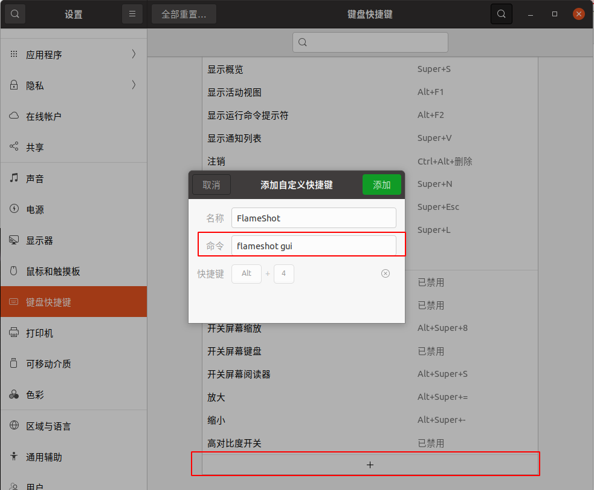

## 1 系统安装
{: id="20210110110127-fjinus0"}

### 桌面版安装
{: id="20210110110127-cfs5k3r"}

首先是安装 Ubuntu 最新版本，从[官网](https://ubuntu.com/download/desktop)中寻找下载，https://ubuntu.com/download/desktop。
{: id="20210110110127-jhhviiw"}

你也可以从 Ubuntu 的[官方镜像站](http://cloud-images.ubuntu.com/?_ga=2.241655362.1756405896.1609845185-1525960103.1609845185)中寻找自己想要下载的镜像，http://cloud-images.ubuntu.com/?_ga=2.241655362.1756405896.1609845185-1525960103.1609845185。
{: id="20210110110127-p8vgm05"}

目前 20.04 TLS 的 64 位版本 arm 和 x86 都可以使用。
{: id="20210110110127-t4dadmc"}

按照[官网的指示](https://ubuntu.com/tutorials/install-ubuntu-desktop)一步步安装即可，https://ubuntu.com/tutorials/install-ubuntu-desktop 。
{: id="20210110110127-xlf7j0n"}

用 u 盘安装进固态硬盘需要对固态进行分区操作，需要分出 bios 区域(512m)、efi 系统分区(1024m)、swap 分区用于休眠（4G（不休眠）/20G（需休眠））和其他的直接省事 ext4 日志文件系统格式全分配为 `\` 拓展分区。
{: id="20210110110127-01204e8"}

### 服务器安装
{: id="20210110110127-86kh9cb"}

如果只使用命令行模式，则可以下载对于的[服务器版本](https://ubuntu.com/download/server)，https://ubuntu.com/download/server
{: id="20210110110127-a37guiw"}

按照[官方指导](https://ubuntu.com/tutorials/install-ubuntu-server#1-overview)进行安装，https://ubuntu.com/tutorials/install-ubuntu-s#1-overview#
{: id="20210110110127-42umi3c"}

# 常用软件安装
{: id="20210110110236-xwwg3hx"}

### v2ray 相关 vpn 安装
{: id="20210110110259-2td3aba"}

((20210110110411-eb83f2v "ubuntu-安装 v2ray 并配置"))
{: id="20210110112821-7qjisw1"}

### 截图软件安装
{: id="20210121190301-0wu2a3j"}

[flameshot ](https://github.com/flameshot-org/flameshot)是一个很好用的截图软件，并且不断的更新中
{: id="20210121191906-shnnuq5"}

```
# flameshot 一个支持自定义截图的截屏软件
sudo apt install flameshot
# 执行截图
flameshot gui
```
{: id="20210121190309-g0x2q0v"}

我们可以对默认的抓屏按键进行修改，当然也可以绑定自己的快捷键，这里我选择绑定自己的快捷键 `alt+4`
{: id="20210121190427-36e29vc"}

* {: id="20210121190433-deif0o0"}进入系统设置中的“键盘快捷键”
  {: id="20210228113749-qdru2f3"}
* {: id="20210121190425-v45v3z7"}页面中会列出所有现有的键盘快捷键，拉到底部就会看见一个 “+” 按钮
  {: id="20210228113749-zmmtte8"}
* {: id="20210121190425-ebyl8y5"}点击 “+” 按钮添加自定义快捷键并输入以下两个字段：
  {: id="20210228113749-pi9i2jc"}

  * {: id="20210121190425-jzzlexh"}“名称”： 任意名称均可。
    {: id="20210228113749-m95oxih"}
  * {: id="20210121190425-qvmp30x"}“命令”： `flameshot gui`
    {: id="20210228113749-7k1bcy4"}
  {: id="20210121190425-beg1s0n"}
{: id="20210121190425-l1i0kjs"}


{: id="20210121181355-37j3uuf"}

之后就可以使用快捷键愉快的截图啦。
{: id="20210121191638-b2rjd5z"}

{: id="20210122225943-u4gaz7v"}

### obs直播安装
{: id="20210228113812-pqjw8yh" updated="20210228113823"}

obs直播需要用到`ffmpeg`
{: id="20210228113823-swtd4jd" updated="20210228113955"}

```
sudo apt install ffmpeg
```
{: id="20210228113904-to2lucl" updated="20210228113905"}

之后使用以下命令安装
{: id="20210228113812-szxyxwk" updated="20210228113932"}

```
sudo add-apt-repository ppa:obsproject/obs-studio
sudo apt update
sudo apt install obs-studio
```
{: id="20210228113923-0529vza" updated="20210228113924"}

{: id="20210228113909-6ih7yr5"}

{: id="20210122225943-5eupbux"}

### 网络下载应用安装
{: id="20210110110525-upk55qn"}

我们通过下载网络应用，在 ubuntu 中安装对应软件，
{: id="20210110111135-no5py7r"}

```
# 对无法双脚安装的应用进行安装
# --instdir 指定安装目录
# dpkg -x same.deb 解压到当前目录
sudo dpkg -i "software.deb"
# 如果提示依赖问题 安装所有依赖
sudo apt-get install -f
# 卸载通过
# 通过 dpkg -l soft* 去查找卸载软件的完整名称
sudo dpkg --remove softname

```
{: id="20210110111200-cbn5w01"}

{: id="20210228135109-wxciyjz" updated="20210228135109"}

### apt 下载加速
{: id="20210122225943-81a5vci" updated="20210228135114"}

配置`/etc/apt/apt.conf`
{: id="20210228135139-5wfb036" updated="20210228135156"}

```bash
sudo nano /etc/apt/apt.conf
```
{: id="20210228135140-mevhlzj" updated="20210228135147"}

配置对应你需要加速的节点
{: id="20210228135153-fz8jc9t" updated="20210228135308"}

```bash
Acquire::http::Proxy "http://127.0.0.1:8889";
Acquire::https::Proxy "http://127.0.0.1:8889";
#Acquire::https::Proxy "socks5://127.0.0.1:1089"

```
{: id="20210228135153-2auw6h2" updated="20210228135313"}

之后就可以愉快的进行apt install 了
{: id="20210228135153-9oa84hc" updated="20210228135331"}

{: id="20210306143736-ploxosw" updated="20210228135329"}

### 软件单独配置代理
{: id="20210228135329-il77alh" updated="20210306143745"}

有的软件是不会使用全局代理的 需要使用proxychains进行代理运行
{: id="20210306143745-erqudai" updated="20210306143810"}

```bash
sudo apt install proxychains

sudo nano /etc/proxychains.confg

# in the last line place your proxy information like this:

#socks4         127.0.0.1 9050
socks5          127.0.0.1 1080


# run software on proxy

proxychains steam
```
{: id="20210306143811-rxzwnoy" updated="20210306143937"}


{: id="20210105194423-yg7b5jv" type="doc"}
