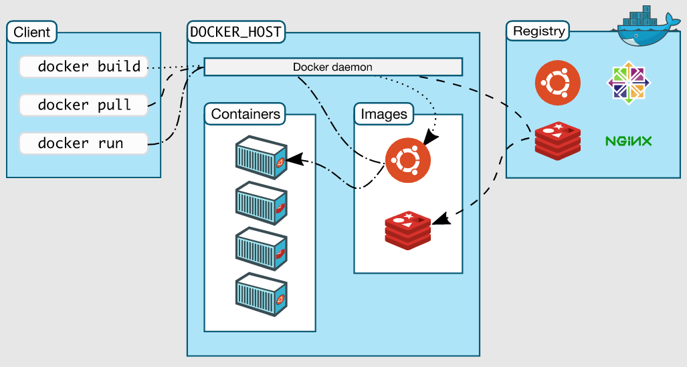

## Dock 工作流程
{: id="20210125122452-xwfw293"}


{: id="20210125122454-r5xeh3u"}

{: id="20210125222849-iq889ba"}

## 安装 Docker
{: id="20210125115557-u24f4jq"}

环境准备: Linux , ssh
{: id="20210125121754-16llpue"}

用到的网站:
{: id="20210125121840-8kid908"}

* {: id="20210125121817-fzhlyqk"}[docker 教程](https://www.bilibili.com/video/BV1og4y1q7M4?p=6):https://www.bilibili.com/video/BV1og4y1q7M4
* {: id="20210125121817-cjhfsly"}[docker-document](https://docs.docker.com/):https://docs.docker.com/
{: id="20210125121817-nfsboj9"}

> 以下以 Ubuntu20.04LTS 进行安装操作,具体其他操作系统查看[官方文档](https://docs.docker.com/engine/install/):https://docs.docker.com/engine/install/
> {: id="20210125123139-4ezav4e"}
{: id="20210125122149-7nuf439"}

### 卸载旧版本
{: id="20210125120608-h9durcg"}

```shell
sudo apt-get remove docker docker-engine docker.io containerd runc

```
{: id="20210125122218-64qqkr9"}

{: id="20210125222849-983wmli"}

### 安装新版本
{: id="20210125121420-k9qs1e8"}

```shell

# 更新 apt-get
sudo apt-get update

# 安装 apt 依赖包，用于通过HTTPS来获取仓库:
sudo apt-get install \
    apt-transport-https \
    ca-certificates \
    curl \
    gnupg-agent \
    software-properties-common

# 加Docker官方GPG key:
curl -fsSL https://download.docker.com/linux/ubuntu/gpg | sudo apt-key add -

# 设定 stable版本的镜像存储库(用于下载Docker)
sudo add-apt-repository \
   "deb [arch=amd64] http://mirrors.aliyun.com/docker-ce/linux/ubuntu \
   $(lsb_release -cs) \
   stable"

# 安装安装最新版本的 Docker Engine-Community 和 containerd 
sudo apt-get install docker-ce docker-ce-cli containerd.io
```
{: id="20210125122221-7gmzse0"}

> 在设定 docker 镜像存储库时,官方指定的仓库为:https://download.docker.com/linux/ubuntu
> {: id="20210125225103-nb6wki7"}
>
> 这里我改为的是 aliyun 的国内镜像仓库用于加速下载;
> {: id="20210125225103-8zhwcg4"}
>
> 加入并验证 Docker GPG key 并不是必须的步骤,只需要在 apt-get 添加 `--nogpgcheck`
> {: id="20210125225118-rctb1wm"}
{: id="20210125224958-pehyirv"}

{: id="20210125225052-owfl4il"}

### 更新
{: id="20210125225002-zcpmze0"}

```shell
# 更新docker 需要卸载旧版本后安装新版本
```
{: id="20210125225012-no97jdi"}

### 小结
{: id="20210125225001-ipm3x7f"}

这一套 Docker 命令行安装还不如自己手动下载 deb,用 dpkg 安装来的简单
{: id="20210125222849-nxqhdxt"}

deb 安装包地址:
{: id="20210125225413-1nuib3n"}

### 设置镜像库
{: id="20210125121431-6l1jkwb"}

{: id="20210125222849-bx0csnk"}


{: id="20210125115524-zotzeow" type="doc"}
