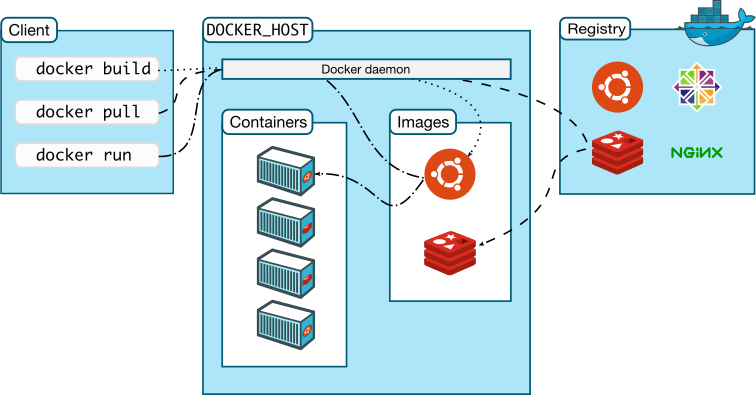

## Dock 工作流程
{: id="20210125122452-xwfw293"}

### DOcker 与虚拟机的区别
{: id="20210125233920-q39gnal"}


{: id="20210125233921-1djadhv"}

{: id="20210126001753-h9l2dxk"}

### Docker 纵览
{: id="20210125233936-ajvlhy5"}

在 Docker 的术语里，一个只读层被称为镜像，一个镜像是永久不会变的。
{: id="20210125234213-iyfquiy"}

每一个镜像都可能依赖于由一个或多个下层的组成的另一个镜像。我们有时说，下层那个 镜像是上层镜像的父镜像。
{: id="20210125234339-uiu98c0"}


{: id="20210125234219-fg7i9qi"}

{: id="20210126001753-m2yf53d"}

所有镜像都是通过一个 64 位十六进制字符串 （内部是一个 256 bit 的值）来标识的。 为简化使用，前 12 个字符可以组成一个短 ID，可以在命令行中使用。短 ID 还是有一定的 碰撞机率，所以服务器总是返回长 ID。
{: id="20210125234342-psngleg"}

{: id="20210126001753-p8r9im1"}


{: id="20210125122454-r5xeh3u"}

{: id="20210126001753-0fadz85"}

## 安装 Docker
{: id="20210125115557-u24f4jq"}

环境准备: Linux , ssh
{: id="20210125121754-16llpue"}

用到的网站:
{: id="20210125121840-8kid908"}

* {: id="20210125121817-fzhlyqk"}[docker 教程](https://www.bilibili.com/video/BV1og4y1q7M4?p=6):https://www.bilibili.com/video/BV1og4y1q7M4
* {: id="20210125121817-cjhfsly"}[docker-document](https://docs.docker.com/):https://docs.docker.com/
* {: id="20210125234031-8gmjvn2"}[docker 中文文档](http://www.dockerinfo.net):http://www.dockerinfo.net
{: id="20210125121817-nfsboj9"}

> 以下以 Ubuntu20.04LTS 进行安装操作,具体其他操作系统查看[官方文档](https://docs.docker.com/engine/install/):https://docs.docker.com/engine/install/
> {: id="20210125123139-4ezav4e"}
{: id="20210125122149-7nuf439"}

### 卸载旧版本
{: id="20210125120608-h9durcg"}

```shell
sudo apt-get remove docker docker-engine docker.io containerd runc
# 如果需要彻底卸载docker 包括docker下载的镜像,则执行如下命令
sudo rm -rf /var/lib/docker
```
{: id="20210125122218-64qqkr9"}

{: id="20210126001753-912x8ki"}

### 安装新版本
{: id="20210125121420-k9qs1e8"}

```shell

# 更新 apt-get
sudo apt-get update

# 安装 apt 依赖包，用于通过HTTPS来获取仓库:
sudo apt-get install \
    apt-transport-https \
    ca-certificates \
    curl \
    gnupg-agent \
    software-properties-common

# 加Docker官方GPG key:
curl -fsSL https://download.docker.com/linux/ubuntu/gpg | sudo apt-key add -

# 设定 stable版本的镜像存储库(用于下载Docker)
sudo add-apt-repository \
   "deb [arch=amd64] http://mirrors.aliyun.com/docker-ce/linux/ubuntu \
   $(lsb_release -cs) \
   stable"

# 安装安装最新版本的 Docker Engine-Community 和 containerd 
sudo apt-get install docker-ce docker-ce-cli containerd.io
```
{: id="20210125122221-7gmzse0"}

> 在设定 docker 镜像存储库时,官方指定的仓库为:https://download.docker.com/linux/ubuntu
> {: id="20210125225103-nb6wki7"}
>
> 这里我改为的是 aliyun 的国内镜像仓库用于加速下载;
> {: id="20210125225103-8zhwcg4"}
>
> 加入并验证 Docker GPG key 并不是必须的步骤,只需要在 apt-get 添加 `--nogpgcheck`
> {: id="20210125225118-rctb1wm"}
>
> 通过 `sudo docker run hello-world`, 进行测试 docker 是否正常工作.
> {: id="20210125231755-v9bed15"}
{: id="20210125224958-pehyirv"}

{: id="20210126001753-qmgo26b"}

### 更新
{: id="20210125225002-zcpmze0"}

```shell
# 更新docker 需要卸载旧版本后安装新版本
```
{: id="20210125225012-no97jdi"}

### 小结
{: id="20210125225001-ipm3x7f"}

这一套 Docker 命令行安装还不如自己手动下载 deb,用 `sudo dpkg -i /path/to/package.deb` 来的方便.
{: id="20210125225754-bam5tcj"}

ubuntu 的 deb 安装包地址:[https://download.docker.com/linux/ubuntu/dists/](https://download.docker.com/linux/ubuntu/dists/)
{: id="20210125231511-l8thx6s"}

通过 `lsb_release -a` 查看自己系统版本的代号,在对应代号后下的/pool/stable/里下载符合自己系统的
{: id="20210125230035-inmw7ls"}

`containerd.io_x.deb`,`docker-ce-cli_x.deb`,`docker-ce_x.deb`,并手动 dpkg 安装.
{: id="20210125231431-7earg33"}


{: id="20210125230132-0xp28vy"}

{: id="20210126001753-0i60jie"}

### 设置镜像库
{: id="20210125121431-6l1jkwb"}

{: id="20210126001753-byk6iqx"}

{: id="20210126001753-593vnu7"}

## Docker 使用
{: id="20210125233255-a5cnl6j"}

`docker --help` 获取 docker 的所有命令,下面介绍一些简单的 docker 命令
{: id="20210125234531-kktcp9b"}

### 镜像相关指令
{: id="20210125235809-ejkg8fm"}

#### 获取镜像
{: id="20210125234532-ef5pnpr"}

可以使用 `docker pull` 命令来从仓库获取所需要的镜像。我们可以先去 [DockerHub](https://hub.docker.com/search) 查看自己需要的镜像或者使用 docker search pakege, 搜索指令.
{: id="20210125234544-cx385se"}

下面的例子将从 Docker Hub 仓库下载一个 Ubuntu 12.04 操作系统的镜像。
{: id="20210125234544-nap3obi"}

```
$ docker search ubuntu

(base) vase@vase:~/coding/docker$ sudo docker pull ubuntu:18.04
18.04: Pulling from library/ubuntu
d519e2592276: Pull complete 
d22d2dfcfa9c: Pull complete 
b3afe92c540b: Pull complete 
Digest: sha256:ea188fdc5be9b25ca048f1e882b33f1bc763fb976a8a4fea446b38ed0efcbeba
Status: Downloaded newer image for ubuntu:18.04
docker.io/library/ubuntu:18.04
```
{: id="20210125234544-vylzlre"}

> 上述命令等同于 `sudo docker pull registry.hub.docker.com/ubuntu:12.04`
> {: id="20210125234957-4jhfyi0"}
>
> 即从注册服务器 `registry.hub.docker.com` 中的 `ubuntu` 仓库来下载标记为 `12.04` 的镜像。
> {: id="20210125235037-52jc5nt"}
{: id="20210125234956-vcbv78t"}

完成后，即可随时使用该镜像了，例如创建一个容器，让其中运行 bash 应用。
{: id="20210125234959-8qo11ta"}

```
(base) vase@vase:~/coding/docker$ sudo docker images
REPOSITORY    TAG       IMAGE ID       CREATED         SIZE
ubuntu        18.04     c090eaba6b94   4 days ago      63.3MB
hello-world   latest    bf756fb1ae65   12 months ago   13.3kB
```
{: id="20210125235122-ax993bg"}

{: id="20210126001753-ul3waa8"}

#### 列出本地镜像
{: id="20210125235134-a3eejyd"}

使用 `docker images` 显示本地已有的镜像。
{: id="20210125235151-nsr08r5"}

在列出信息中，可以看到几个字段信息
{: id="20210125235210-8st6rp1"}

* {: id="20210125235210-60vxxid"}来自于哪个仓库，比如 ubuntu
* {: id="20210125235210-wf75h1a"}镜像的标记，比如 18.04
* {: id="20210125235210-23p6c4d"}它的 `ID` 号（唯一）
* {: id="20210125235210-p3c197m"}创建时间
* {: id="20210125235210-jwkhund"}镜像大小
{: id="20210125235210-o4i8lcw"}

其中镜像的 `ID` 唯一标识了镜像，如果 ID 相同表示他为同一个镜像。
{: id="20210125235210-tstqcvu"}

`TAG` 信息用来标记来自同一个仓库的不同镜像。例如 `ubuntu` 仓库中有多个镜像，通过 `TAG` 信息来区分发行版本，例如 `18.04`、`20.04` 等。例如下面的命令指定使用镜像 `ubuntu:18.04 来启动一个容器。
{: id="20210125235210-a8tj7le"}

#### 删除镜像
{: id="20210125235210-tzb0kjc"}

使用 `docker rmi -f 镜像ID [镜像ID...]` 删除指定的单个或多个镜像。
{: id="20210125235827-xzrc3wa"}

使用 `docker rmi -f $(docker images -aq)` 删除全部镜像。
{: id="20210125235828-xely6yb"}

### 容器相关指令
{: id="20210125235828-qrg3srp"}

{: id="20210126001753-xcn6x7i"}

#### 新建容器并启动
{: id="20210126000055-v1viofz"}

`docker run [args] image`:启动容器
{: id="20210126000210-pnpw1wf"}

> 参数可选项:
> {: id="20210126000308-g315it6"}
>
> * {: id="20210126000527-wz1w4y2"}--name="Name" 设定容器名称
> * {: id="20210126000531-11ga3gc"}-d 后台方式运行
> * {: id="20210126000534-u7q54fe"}-it 使用交互方式运行,进入容器查看
> * {: id="20210126000539-nj469xu"}-p 指定容器端口 -p 主机端口:容器端口
>   * {: id="20210126000559-zge16ax"}不填写默认随即端口
>   {: id="20210126000559-z93n3dn"}
> {: id="20210126000315-fzeoi3l"}
{: id="20210126000307-1ryoxwp"}

`docker run -it image /bin/bash` :启动镜像并使用 bash
{: id="20210126000614-3q1n8f2"}

```shell
(base) vase@vase:~/coding/docker$ sudo docker run -it ubuntu:18.04
root@9bf2011b3744:/# ls
bin  boot  dev  etc  home  lib  lib64  media  mnt  opt  proc  root  run  sbin  srv  sys  tmp  usr  var

```
{: id="20210126001509-umx2cgw"}

{: id="20210126001836-ll7bb0f"}

#### 退出当前容器
{: id="20210126001833-herwmi7"}

`exit`: 退出当前容器(会自动关闭该容器)
{: id="20210126001857-lgw2mrk"}

`ctrl+p+q`:退出当前容器(该容器不会退出)
{: id="20210126001919-7xamosa"}

 
{: id="20210126001753-ecf7jqj"}

#### 查看运行的容器
{: id="20210126001540-4robn0a"}

`docker ps [args]`
{: id="20210126001615-jxogbyq"}

> 参数可选项:
> {: id="20210126001622-oo89qj6"}
>
> * {: id="20210126001640-c458mjh"}-a 列出历史运行过的容器
> * {: id="20210126001655-mqyqn9b"}-n=? 列出最近运行的?个容器
> * {: id="20210126001804-tncp7b2"}-aq 列出运行容器的 ID
> {: id="20210126001638-q5kugss"}
{: id="20210126001621-6f19sxa"}

```shell
(base) vase@vase:~/coding/docker$ sudo docker ps
CONTAINER ID   IMAGE          COMMAND       CREATED         STATUS         PORTS     NAMES
9bf2011b3744   ubuntu:18.04   "/bin/bash"   5 minutes ago   Up 5 minutes             stoic_jang

```
{: id="20210126001754-i4o8160"}

{: id="20210126002101-c8kl65j"}

#### 删除容器
{: id="20210126001755-4ye7sy9"}

`docker rm 容器ID`:删除指定容器
{: id="20210126001800-0k26pj4"}

`docker rm -f $(docker ps -aq)`:强制删除全部容器
{: id="20210126002132-qo0hwl1"}

{: id="20210126002117-gezi9la"}


{: id="20210125115524-zotzeow" type="doc"}
