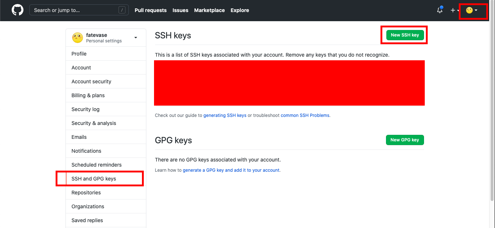

## 前期准备
{: id="20210125120131-s8mmg7y"}

### 第一步：注册账号 GitHub 官网
{: id="20210110105947-2f1h2jl"}

### 第二步：创建 SSH Key。
{: id="20210110105947-xo2sjca"}

在用户主目录下，看看有没有。SSH 目录，如果有，再看看这个目录下有没有 id_rsa 和 id_rsa.pub 这两个文件，如果已经有了，可直接跳到下一步。
{: id="20210125120459-l57e78b"}

如果没有，打开 Shell（Windows 下打开 Git Bash），创建 SSH Key：
{: id="20210110105947-hoblo31"}

> ssh-keygen -t rsa -C "youremail@example.com"
> {: id="20210110105947-ba2uuyh"}
{: id="20210110105947-akcxiq8"}

然后一路回车，使用默认值即可，由于这个 Key 也不是用于军事目的，所以也无需设置密码。
{: id="20210110105947-rmdu5xw"}

如果一切顺利的话，可以在用户主目录里找到。SSH 目录，里面有 id_rsa 和 id_rsa.pub 两个文件，这两个就是 SSH Key 的秘钥对，id_rsa 是私钥，不能泄露出去，id_rsa.pub 是公钥，可以放心地告诉任何人。
打开 id_rsa.pub，复制里面的内容。
{: id="20210125120503-w6ooa1o"}

### 第三步:
{: id="20210110105947-qel03h0"}

登陆 GitHub，打开“Account settings”，“SSH Keys and GPG keys”页面：
{: id="20210125120507-lkadsd7"}

然后，点“New SSH Key”，填上任意 Title，在 Key 文本框里粘贴 id_rsa.pub 文件的内容即可。
{: id="20210110105947-dip0yov"}


{: id="20210110105947-ard35h7"}

点“Add Key”，你就应该看到已经添加的 Key。
{: id="20210110105947-p2b73f6"}

### 综述
{: id="20210125120515-4po5584"}

为什么 GitHub 需要 SSH Key 呢？因为 GitHub 需要识别出你推送的提交确实是你推送的，而不是别人冒充的，而 Git 支持 SSH 协议，所以，GitHub 只要知道了你的公钥，就可以确认只有你自己才能推送。
{: id="20210110105947-fxdi207"}

当然，GitHub 允许你添加多个 Key。假定你有若干电脑，你一会儿在公司提交，一会儿在家里提交，只要把每台电脑的 Key 都添加到 GitHub，就可以在每台电脑上往 GitHub 推送了。
{: id="20210110105947-mso3p8g"}

> 友情提示，在 GitHub 上免费托管的 Git 仓库，任何人都可以看到喔（但只有你自己才能改）。所以，不要把敏感信息放进去。
> {: id="20210125120241-6lpycmi"}
{: id="20210110105947-529k7kg"}

{: id="20210125120433-po33gf8"}

## 创建仓库
{: id="20210110105947-sn1f2pr"}

然后你可以创建仓库了
首先，登陆 GitHub，然后，在右上角找到“Create a new repo”按钮，创建一个新的仓库
{: id="20210110105947-zb1ylft"}

### 方法一：
{: id="20210125120440-1bctp4u"}

把本地已有的同名 Git 仓库和 GitHub 上的仓库关联起来
我们在本地新建了一个名为 Gittest 的文件夹
{: id="20210110105947-rz5s5fw"}

> Git init
> {: id="20210110105947-5807eda"}
{: id="20210110105947-s19hbn8"}

将 Gittest 文件夹设置为 Git 仓库
添加文件，比如我们新写了一个 readme 文件
并提交到了本地仓库，接下来我们把本地仓库和远程仓库联系起来
{: id="20210110105947-3v5386k"}

```bash
git init
echo "test" >> README.md
git commit -m "first commit"
git remote add origin git@github.com:YourName/ProjectName.git
```
{: id="20210110105947-w6mbrdg"}

添加后，远程库的名字就是 origin，这是 Git 默认的叫法，也可以改成别的，但是 origin 这个名字一看就知道是远程库
下一步，就可以把本地库的所有内容推送到远程库上
{: id="20210110105947-30e62b9"}

> Git push -u origin master
> {: id="20210110105947-f7llvt3"}
{: id="20210110105947-p9fbfzv"}

由于远程库是空的，我们第一次推送 master 分支时，加上了-u 参数，Git 不但会把本地的 master 分支内容推送的远程新的 master 分支，还会把本地的 master 分支和远程的 master 分支关联起来，在以后的推送或者拉取时就可以简化命令。
{: id="20210110105947-2cu2cl6"}

此后 Git add Git commit-m 之后 就可以使用
{: id="20210110105947-or65icb"}

> Git push origin master
> {: id="20210110105947-k68go77"}
{: id="20210110105947-pyvzcae"}

### 方法二：
{: id="20210110105947-3ruvxs1"}

使用 Git clone 直接从远程仓库克隆下来
{: id="20210110105947-1wv89x9"}

前面我们讲了先有本地库，后有远程库的时候，如何关联远程库。
{: id="20210110105947-0be6kmq"}

现在，假设我们从零开发，那么最好的方式是先创建远程库，然后，从远程库克隆。
{: id="20210110105947-s9sishq"}

首先，登陆 GitHub，创建一个新的仓库，名字叫 Gittest
{: id="20210110105947-8ctt94d"}

我们在本地使用 Git clone 直接把远程仓库克隆下来。
{: id="20210110105947-1slgw3e"}

> Git clone git@github.com:MachinePlay/Gittest.git
> {: id="20210110105947-3noi47o"}
{: id="20210110105947-1nl4q8o"}

总过程是通过 Git 链接上你的 GitHub
{: id="20210110105947-ukqqe52"}

{: id="20210125120433-wdmuw8w"}

## 提交内容
{: id="20210125120335-4hasn85"}

{: id="20210125120433-sk7cz1j"}

> git commit -m 'my project push' #给提交做备注
> git push origin <branch> #提交一次 push
> {: id="20210125120412-mynx8yx"}
{: id="20210125120350-s98hhi3"}

{: id="20210125120433-f7r4hxp"}

## 命令小结
{: id="20210125120349-zygmn9g"}

```bash
 .#push
git init # 在你对应目录下生成git仓库
git status # 通过查看状态看看仓库中那些东西会被上传到github中(绿色的为会提交的)

git remote add origin git@github.com:YourName/ProjectName.git #链接你的github对应的仓库

git add <file> # 添加要提交的文件 . 表示全部文件
git rm -r --cached <file> #删除不需要提交的文件

git branch #查看有那些分之

git commit -m 'my project push' #给提交做备注
git push origin <branch> #提交一次push


# pull 
git pull origin master

#clone
git clone https://github.com/ProjectName.git #将对应的项目下载下来


```
{: id="20210110105947-5diroam"}

> Git config -l 查看配置文件信息
> {: id="20210110105947-hhy3h4h"}
{: id="20210110105947-kpn7yu9"}

> master 指的是主分支名，如果是其他分支，则填写相应的分支名
> {: id="20210110105947-be0vbor"}
{: id="20210110105947-tsa953d"}


{: id="20201120095601-8jm5kh2" type="doc"}
