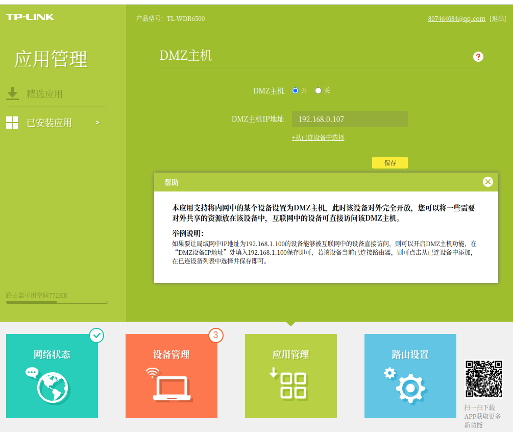

### 安装 nginx
{: id="20210130003232-lpqav6m"}

```shell
apt install nginx

# 请确保80端口没有被其他服务占用
/etc/init.d/nginx start

# 测试配置文件是否正常
nginx -t

nginx           #启动
nginx -s reload #重新加载配置文件
nginx -s quit   #优雅退出
nginx -s stop   #立即停止
nginx -t        #验证配置文件
```
{: id="20210130003242-3a1m052"}

Ubuntu 安装之后的文件结构大致为:
{: id="20210130003411-w3fhh32"}

* {: id="20210130003411-yon7d8r"}所有的配置文件都在/etc/nginx 下,并且每个虚拟主机已经安排在了/etc/nginx/sites-available 下
{: id="20210130003411-b6iiu9h"}

* {: id="20210130003414-l358dm1"}程序文件在/usr/sbin/nginx * 日志放在了/var/log/nginx 中
{: id="20210130003411-3ojw9wh"}

* {: id="20210130003415-nfspr1d"}并已经在/etc/init.d/下创建了启动脚本 nginx
{: id="20210130003411-uplwf34"}

* {: id="20210130003411-hgabzl2"}默认的虚拟主机的目录设置在了/var/www/nginx-default
{: id="20210130003411-g1avt6f"}

nginx 安装好之后，会创建/etc/nginx/conf.d/default.conf 文件，里面记录网站的配置信息。
{: id="20210130003411-2hpgc00"}

server {
listen       80;
server_name  localhost;
{: id="20210130014850-9ed4jty"}

```
#charset koi8-r;
#access_log  /var/log/nginx/host.access.log  main;

location / {
    root   /var/website;
    index  index.html index.htm;
}

#error_page  404              /404.html;

# redirect server error pages to the static page /50x.html
#
error_page   500 502 503 504  /50x.html;
location = /50x.html {
    root   /usr/share/nginx/html;
}

# proxy the PHP scripts to Apache listening on 127.0.0.1:80
#
#location ~ \.php$ {
#    proxy_pass   http://127.0.0.1;
#}

# pass the PHP scripts to FastCGI server listening on 127.0.0.1:9000
#
#location ~ \.php$ {
#    root           html;
#    fastcgi_pass   127.0.0.1:9000;
#    fastcgi_index  index.php;
#    fastcgi_param  SCRIPT_FILENAME  /scripts$fastcgi_script_name;
#    include        fastcgi_params;
}

# deny access to .htaccess files, if Apache's document root
# concurs with nginx's one
#
#location ~ /\.ht {
#    deny  all;
#}
}
```
{: id="20210130014850-mr5pgcn"}

#### 参数介绍
{: id="20210130014908-zaf5zhr"}

* {: id="20210130014953-b782ibs"}listen - 定义 Nginx 将侦听的端口。
* {: id="20210130014908-n11iruc"}root - 定义存储网站服务的文档根目录。
* {: id="20210130014908-a0rcp67"}index- 配置 Nginx 请求索引文件时优先处理 index.php 命名的文件。
* {: id="20210130014908-9hp0kuu"}server_name - 将此指令指向服务器的域名或公共 IP 地址。
* {: id="20210130014908-x15zyxh"}location /- 第一个位置块包括一个 try_files 指令，该指令检查是否存在满足 URI 请求的文件。如果 Nginx 找不到合适的文件，则会返回 404 错误。
* {: id="20210130014908-6iyouo4"}location ~ .php$- 此位置块通过将 Nginx 指向 fastcgi-php.conf 配置文件和 php7.2-fpm.sock 文件来处理实际的 PHP 处理，该文件声明了与哪个套接字相关联 php-fpm。检查/etc/php/7.0/fpm/pool.d/www.conf 文件并查找“listen”行。
* {: id="20210130014908-vtqkh58"}location ~ /.ht- 通过添加 deny all 指令，如果任何.htaccess 文件碰巧进入文档根目录，它们将不会被提供给访问者。
{: id="20210130014908-55n550q"}

#### 修改内容
{: id="20210130014941-xpn5v97"}

1. {: id="20210130014941-kbyd8xf"}将 root(网站根目录) 设置放在外面
2. {: id="20210130014941-2023izc"}将 index 设置放在外面
3. {: id="20210130014941-wh5o9ij"}打开.php 文件的解析设置内容。就是“ location ~ .php$ { … }”这一段内容
{: id="20210130014941-z8rq06t"}

```nginx
        location ~ \.php$ {
                include snippets/fastcgi-php.conf;
                # With php-fpm (or other unix sockets):
                fastcgi_pass unix:/var/run/php/php7.4-fpm.sock;
                fastcgi_param SCRIPT_FILENAME $document_root$fastcgi_script_name;
                # With php-cgi (or other tcp sockets):
        #       fastcgi_pass 127.0.0.1:9000;
        }

```
{: id="20210130014941-q7dfnq0"}

> php-fpm 的 fpm 指 FastCGI Process Manager：FastCGI 进程管理器，是一种面向高负载的 PHP 解释器。现在算是主流的 PHP 解释器。关于 PHP-FPM 更多的资料可以参考 [nginx 如何解析 php 文件 php-fpm 的解释](https://www.jianshu.com/p/f7fd7aa6c1c6)。
> {: id="20210130015406-moksvy5"}
{: id="20210130003411-3ikx2zv"}

#### 测试启动
{: id="20210130015413-j1rrk1d"}

```shell
# 测试配置文件是否正常
nginx -t
# 如果报告了任何错误，请返回并重新检查您的文件，然后再继续。

# 重新加载Nginx的配置文件
/etc/init.d/nginx reload


```
{: id="20210130015511-p8r7cci"}

### 安装 php7
{: id="20210130001815-ry9wdu3"}

ubuntu 20.04 使用 `apt install php` 自动会安装 php7.4
{: id="20210130001904-2gh1nh9"}

默认安装会安装如下的扩展
{: id="20210130010546-vpzxhs3"}

```shell
php-all-dev/focal 2:75 all
php-amqp/focal 1.9.4-3ubuntu1 amd64
php-amqplib/focal 2.11.0-2 all
php-apcu-bc/focal 1.0.5-2build1 amd64
php-apcu/focal 5.1.18+4.0.11-1build1 amd64
php-ast/focal 1.0.5-1build1 amd64
php-auth-sasl/focal 1.0.6-3 all
php-bcmath/focal 2:7.4+75 all
php-bz2/focal 2:7.4+75 all
php-cache-integration-tests/focal 0.16.0-3 all
php-cache-lite/focal 1.8.2-1build3 all
php-cache-tag-interop/focal 1.0.0-2 all
php-cas/focal 1.3.8-1 all
php-cboden-ratchet/focal 0.4.1-3 all
php-cgi/focal 2:7.4+75 all
php-cli/focal 2:7.4+75 all
php-cocur-slugify/focal 3.1-1 all
php-codecoverage/focal 7.0.10+dfsg-1 all
php-codesniffer/focal 3.5.4-1 all
php-common/focal,now 2:75 all [installed,automatic]
php-composer-ca-bundle/focal 1.2.6-1 all
php-composer-semver/focal 1.5.1-1 all
php-composer-spdx-licenses/focal 1.5.3-1 all
php-composer-xdebug-handler/focal 1.4.0-1 all
php-console-commandline/focal 1.2.1-1 all
php-console-table/focal 1.3.1-0.1 all
php-constant-time/focal 2.3.0-1 all
php-curl/focal 2:7.4+75 all
php-date/focal 1.4.7-3 all
php-db-dataobject/focal 1.11.5-1 all
php-db/focal 1.9.3-1build1 all
php-deepcopy/focal 1.9.5-1 all
php-defuse-php-encryption/focal 2.2.1-1 all
php-dev/focal 2:7.4+75 all
php-dflydev-fig-cookies/focal 2.0.0-1 all
php-directory-scanner/focal 1.3.2-3 all
php-doctrine-annotations/focal 1.8.0-1 all
php-doctrine-bundle/focal 2.0.7-1 all
php-doctrine-cache/focal 1.10.0-3 all
php-doctrine-collections/focal 1.6.4-1 all
php-doctrine-common/focal 2.12.0-1 all
php-doctrine-data-fixtures/focal 1.4.2-1 all
php-doctrine-dbal/focal 2.10.1-1 all
php-doctrine-event-manager/focal 1.1.0-1 all
php-doctrine-inflector/focal 1.3.1-1 all
php-doctrine-instantiator/focal 1.3.0-1 all
php-doctrine-lexer/focal 1.2.0-1 all
php-doctrine-orm/focal 2.7.2-1 all
php-doctrine-persistence/focal 1.3.6-1 all
php-doctrine-reflection/focal 1.1.0-1 all
php-dompdf/focal 0.6.2+dfsg-3 all
php-ds/focal 1.2.9-2build1 amd64
php-easyrdf/focal 0.9.1-3 all
php-email-validator/focal 2.1.17-1 all
php-embed/focal 3.3.9-1 all
php-enchant/focal 2:7.4+75 all
php-evenement/focal 3.0.1-2 all
php-excimer/focal 1.0.0~git20190913.d82eaf7-1build1 amd64
php-fabiang-sasl/focal 1.0.0-1 all
php-fdomdocument/focal 1.6.6-2 all
php-fig-link-util/focal 1.1.0-1 all
php-file-iterator/focal 2.0.2-1 all
php-finder-facade-doc/focal 1.2.3-1 all
php-finder-facade/focal 1.2.3-1 all
php-font-lib/focal 0.3.1+dfsg-3 all
php-fpdf/focal 3:1.8.1.dfsg-2 all
php-fpm/focal 2:7.4+75 all
php-fxsl/focal 1.1.1-4 all
php-gd/focal 2:7.4+75 all
php-gearman/focal 2.0.6+1.1.2-7build1 amd64
php-geoip/focal 1.1.1-5build1 amd64
php-geos/focal 1.0.0-5ubuntu2 amd64
php-geshi/focal 1.0.8.11-3 all
php-getid3/focal 1.9.18+dfsg-1 all
php-gmagick/focal 2.0.5~rc1+1.1.7~rc3-5build1 amd64
php-gmp/focal 2:7.4+75 all
php-gnupg/focal 1.4.0-6build1 amd64
php-google-recaptcha/focal 1.2.3-1 all
php-guestfs/focal 1:1.40.2-7ubuntu5 amd64
php-guzzlehttp-promises/focal 1.3.1-2ubuntu1 all
php-guzzlehttp-psr7/focal 1.4.2-0.1 all
php-hamcrest/focal 2.0.0-3build4 all
php-htmlawed/focal 1.1.20-1 all
php-htmlpurifier/focal 4.11.0-1 all
php-http-httplug/focal 2.1.0-1 all
php-http-message-factory/focal 1.0.2-2 all
php-http-promise/focal 1.0.0-2 all
php-http-psr7-integration-tests/focal 0~~20190216-2 all
php-http-request2/focal 2.3.0-1ubuntu2 all
php-http-request/focal 1.4.4-5 all
php-http-webdav-server/focal 1.0.0RC8-1 all
php-http/focal 3.2.3+2.6.0-4build1 amd64
php-httpful/focal 0.3.2-1 all
php-icinga/focal 2.7.3-1 all
php-igbinary/focal 3.1.2+2.0.8-1build1 amd64
php-illuminate-container/focal 5.8.35-1 all
php-illuminate-contracts/focal 5.8.35-1 all
php-illuminate-database/focal 5.8.35-1 all
php-illuminate-support/focal 5.8.35-1 all
php-image-text/focal 0.7.0-2 all
php-imagick/focal 3.4.4-4 amd64
php-imap/focal 2:7.4+75 all
php-interbase/focal 2:7.4+75 all
php-intl/focal 2:7.4+75 all
php-invoker/focal 2.0.0-2 all
php-json-schema/focal 5.2.9-1 all
php-json/focal 2:7.4+75 all
php-klogger/focal 1.2.1-4 all
php-ldap/focal 2:7.4+75 all
php-league-commonmark/focal 1.3.1-1ubuntu2 all
php-league-html-to-markdown/focal 4.9.1-1 all
php-letodms-core/focal 3.4.2-1 all
php-libvirt-php/focal 0.5.5-1 amd64
php-log/focal 1.13.1-1 all
php-lorenzo-pinky/focal 1.0.5-2 all
php-lua/focal 2.0.6+1.1.0+-2build1 amd64
php-luasandbox/focal 3.0.3-2build2 amd64
php-mail-mime/focal 1.10.6-1 all
php-mail/focal 1.4.1-1 all
php-mailparse/focal 3.0.4+2.1.7~dev20160128.repack-0ubuntu1 amd64
php-mapi/focal 8.7.0-7ubuntu1 amd64
php-mapscript-ng/focal 7.4.3-2build1 amd64
php-mapscript/focal 7.4.3-2build1 amd64
php-markdown/focal 1.8.0-1 all
php-masterminds-html5/focal 2.7.0+dfsg-3 all
php-mbstring/focal 2:7.4+75 all
php-mdb2-driver-mysql/focal 1.5.0b4-2 all
php-mdb2-driver-pgsql/focal 1.5.0b4-2 all
php-mdb2/focal 2.5.0b5-2 all
php-memcache/focal 3.0.9~20170802.e702b5f-4build1 amd64
php-memcached/focal 3.1.4+2.2.0-1 amd64
php-mf2/focal 0.3.0-0.1 all
php-mikey179-vfsstream/focal 1.6.8-2 all
php-mime-type/focal 1.3.1-1build1 all
php-mockery-doc/focal 1.3.1-1 all
php-mockery/focal 1.3.1-1 all
php-mongodb/focal 1.6.1-4build1 amd64
php-monolog/focal 1.25.3-1 all
php-msgpack/focal 2.1.0beta1-0ubuntu2 amd64
php-mysql/focal 2:7.4+75 all
php-mythtv/focal 2:31.0+fixes.20200323.9579662cdc-0ubuntu1 all
php-nesbot-carbon/focal 1.27.0-2 all
php-net-dime/focal 1.0.2-3 all
php-net-dns2/focal 1.4.1-2 all
php-net-ftp/focal 1:1.4.0-2 all
php-net-idna2/focal 0.1.1-1 all
php-net-imap/focal 1:1.1.3-2 all
php-net-ipv6/focal 1.3.0b4-1 all
php-net-ldap2/focal 2.2.0-3ubuntu3 all
php-net-ldap3/focal 1.0.4-1 all
php-net-nntp/focal 1.5.0-2 all
php-net-publicsuffix/focal 0.2-1 all
php-net-sieve/focal 1.4.1-1 all
php-net-smtp/focal 1.9.0-1 all
php-net-socket/focal 1.0.14-2 all
php-net-url2/focal 2.2.1-0.1 all
php-net-url/focal 1.0.15-4 all
php-net-whois/focal 1.0.5-3.1 all
php-netscape-bookmark-parser/focal 2.1.0-2 all
php-nikic-fast-route/focal 1.3.0-1 all
php-nrk-predis/focal 1.0.0-1 amd64
php-nyholm-psr7/focal 1.2.1-2 all
php-oauth/focal 2.0.4+1.2.3-1build1 amd64
php-odbc/focal 2:7.4+75 all
php-parsedown/focal 1.7.3-2 all
php-parser/focal 4.2.2-2 all
php-patchwork-utf8/focal 1.3.1-1 all
php-pclzip/focal 2.8.2-5 all
php-pcov/focal 1.0.6-2build1 amd64
php-pear/focal-updates,focal-security 1:1.10.9+submodules+notgz-1ubuntu0.20.04.1 all
php-pecl-http-dev/focal 3.2.3+2.6.0-4build1 all
php-pecl-http/focal 3.2.3+2.6.0-4build1 all
php-pgsql/focal 2:7.4+75 all
php-phar-io-manifest/focal 1.0.3-2 all
php-phar-io-version/focal 2.0.1-1build5 all
php-phpdbg/focal 2:7.4+75 all
php-phpdocumentor-reflection-common/focal 2.0.0-2build4 all
php-phpdocumentor-reflection-docblock/focal 4.3.3-1 all
php-phpdocumentor-type-resolver/focal 1.0.1-2build3 all
php-phpmyadmin-motranslator/focal 5.0.0-1 all
php-phpmyadmin-shapefile/focal 2.1-3 all
php-phpmyadmin-sql-parser/focal 4.6.1-2 all
php-phpseclib/focal 2.0.23-2 all
php-phpspec-prophecy/focal 1.10.2-1 all
php-pimple/focal 3.0.2-2ubuntu1 all
php-pinba/focal 1.1.1-3build1 amd64
php-propro-dev/focal 2.1.0+1.0.2-3build1 all
php-propro/focal 2.1.0+1.0.2-3build1 amd64
php-proxy-manager/focal 2.2.3-2 all
php-ps/focal 1.4.1-1build3 amd64
php-pspell/focal 2:7.4+75 all
php-psr-cache/focal 1.0.1-2 all
php-psr-container/focal 1.0.0-2 all
php-psr-event-dispatcher/focal 1.0.0-1 all
php-psr-http-client/focal 1.0.0-2 all
php-psr-http-factory/focal 1.0.1-2 all
php-psr-http-message/focal 1.0.1-2 all
php-psr-link/focal 1.0.0-2 all
php-psr-log/focal 1.1.2-1 all
php-psr-simple-cache/focal 1.0.1-1 all
php-psr/focal 0.7.0-2build1 amd64
php-pubsubhubbub-publisher/focal 0~~20181009-2 all
php-radius/focal 1.4.0~b1-10build1 amd64
php-raintpl/focal 3.1.0+dfsg-1 all
php-random-compat/focal 2.0.18+git-1 all
php-raphf-dev/focal 2.0.1+1.1.2-1build1 all
php-raphf/focal 2.0.1+1.1.2-1build1 amd64
php-ratchet-pawl/focal 0.3.4-1 all
php-ratchet-rfc6455/focal 0.2.4-2build1 all
php-react-cache/focal 0.5.0-1 all
php-react-child-process/focal 0.5.2-2 all
php-react-dns/focal 0.4.16-1 all
php-react-event-loop/focal 1.0.0-1 all
php-react-http/focal 0.8.3-3 all
php-react-promise-stream/focal 1.1.1-3 all
php-react-promise-timer/focal 1.5.0-2 all
php-react-promise/focal 2.7.0-1 all
php-react-socket/focal 1.1.0-1 all
php-react-stream/focal 1.0.0-2 all
php-readline/focal 2:7.4+75 all
php-redis/focal 5.1.1+4.3.0-1 amd64
php-remctl/focal 3.16-4build3 amd64
php-respect-validation/focal 1.1.29-2 all
php-robmorgan-phinx/focal 0.9.2-3 all
php-rrd/focal 2.0.1+1.1.3-7build1 amd64
php-sabre-vobject/focal 2.1.7-5 all
php-sass/focal 0.7-1build1 amd64
php-seclib/focal 1.0.18-2 all
php-services-json/focal 1.0.3-1build1 all
php-services-weather/focal 1.4.7-4 all
php-shellcommand/focal 1.6.1-1 all
php-snmp/focal 2:7.4+75 all
php-soap/focal 2:7.4+75 all
php-solr/focal 2.5.0+2.4.0-4build1 amd64
php-sql-formatter/focal 1.2.17-3 all
php-sqlite3/focal 2:7.4+75 all
php-ssh2/focal 1.2+0.13-1build1 amd64
php-stomp/focal 2.0.2+1.0.9-3build1 amd64
php-swiftmailer/focal 5.4.2-1.1 all
php-sybase/focal 2:7.4+75 all
php-symfony-amazon-mailer/focal 4.3.8+dfsg-1ubuntu1 all
php-symfony-asset/focal 4.3.8+dfsg-1ubuntu1 all
php-symfony-browser-kit/focal 4.3.8+dfsg-1ubuntu1 all
php-symfony-cache-contracts/focal 1.1.8-1 all
php-symfony-cache/focal 4.3.8+dfsg-1ubuntu1 all
php-symfony-config/focal 4.3.8+dfsg-1ubuntu1 all
php-symfony-console/focal 4.3.8+dfsg-1ubuntu1 all
php-symfony-contracts/focal 1.1.8-1 all
php-symfony-css-selector/focal 4.3.8+dfsg-1ubuntu1 all
php-symfony-debug-bundle/focal 4.3.8+dfsg-1ubuntu1 all
php-symfony-debug/focal 4.3.8+dfsg-1ubuntu1 all
php-symfony-dependency-injection/focal 4.3.8+dfsg-1ubuntu1 all
php-symfony-doctrine-bridge/focal 4.3.8+dfsg-1ubuntu1 all
php-symfony-dom-crawler/focal 4.3.8+dfsg-1ubuntu1 all
php-symfony-dotenv/focal 4.3.8+dfsg-1ubuntu1 all
php-symfony-event-dispatcher-contracts/focal 1.1.8-1 all
php-symfony-event-dispatcher/focal 4.3.8+dfsg-1ubuntu1 all
php-symfony-expression-language/focal 4.3.8+dfsg-1ubuntu1 all
php-symfony-filesystem/focal 4.3.8+dfsg-1ubuntu1 all
php-symfony-finder/focal 4.3.8+dfsg-1ubuntu1 all
php-symfony-form/focal 4.3.8+dfsg-1ubuntu1 all
php-symfony-framework-bundle/focal 4.3.8+dfsg-1ubuntu1 all
php-symfony-google-mailer/focal 4.3.8+dfsg-1ubuntu1 all
php-symfony-http-client-contracts/focal 1.1.8-1 all
php-symfony-http-client/focal 4.3.8+dfsg-1ubuntu1 all
php-symfony-http-foundation/focal 4.3.8+dfsg-1ubuntu1 all
php-symfony-http-kernel/focal 4.3.8+dfsg-1ubuntu1 all
php-symfony-inflector/focal 4.3.8+dfsg-1ubuntu1 all
php-symfony-intl/focal 4.3.8+dfsg-1ubuntu1 all
php-symfony-ldap/focal 4.3.8+dfsg-1ubuntu1 all
php-symfony-lock/focal 4.3.8+dfsg-1ubuntu1 all
php-symfony-mailchimp-mailer/focal 4.3.8+dfsg-1ubuntu1 all
php-symfony-mailer/focal 4.3.8+dfsg-1ubuntu1 all
php-symfony-mailgun-mailer/focal 4.3.8+dfsg-1ubuntu1 all
php-symfony-messenger/focal 4.3.8+dfsg-1ubuntu1 all
php-symfony-mime/focal 4.3.8+dfsg-1ubuntu1 all
php-symfony-monolog-bridge/focal 4.3.8+dfsg-1ubuntu1 all
php-symfony-options-resolver/focal 4.3.8+dfsg-1ubuntu1 all
php-symfony-phpunit-bridge/focal 4.3.8+dfsg-1ubuntu1 all
php-symfony-postmark-mailer/focal 4.3.8+dfsg-1ubuntu1 all
php-symfony-process/focal 4.3.8+dfsg-1ubuntu1 all
php-symfony-property-access/focal 4.3.8+dfsg-1ubuntu1 all
php-symfony-property-info/focal 4.3.8+dfsg-1ubuntu1 all
php-symfony-proxy-manager-bridge/focal 4.3.8+dfsg-1ubuntu1 all
php-symfony-routing/focal 4.3.8+dfsg-1ubuntu1 all
php-symfony-security-acl/focal 3.0.4-1 all
php-symfony-security-bundle/focal 4.3.8+dfsg-1ubuntu1 all
php-symfony-security-core/focal 4.3.8+dfsg-1ubuntu1 all
php-symfony-security-csrf/focal 4.3.8+dfsg-1ubuntu1 all
php-symfony-security-guard/focal 4.3.8+dfsg-1ubuntu1 all
php-symfony-security-http/focal 4.3.8+dfsg-1ubuntu1 all
php-symfony-security/focal 4.3.8+dfsg-1ubuntu1 all
php-symfony-sendgrid-mailer/focal 4.3.8+dfsg-1ubuntu1 all
php-symfony-serializer/focal 4.3.8+dfsg-1ubuntu1 all
php-symfony-service-contracts/focal 1.1.8-1 all
php-symfony-stopwatch/focal 4.3.8+dfsg-1ubuntu1 all
php-symfony-templating/focal 4.3.8+dfsg-1ubuntu1 all
php-symfony-translation-contracts/focal 1.1.8-1 all
php-symfony-translation/focal 4.3.8+dfsg-1ubuntu1 all
php-symfony-twig-bridge/focal 4.3.8+dfsg-1ubuntu1 all
php-symfony-twig-bundle/focal 4.3.8+dfsg-1ubuntu1 all
php-symfony-validator/focal 4.3.8+dfsg-1ubuntu1 all
php-symfony-var-dumper/focal 4.3.8+dfsg-1ubuntu1 all
php-symfony-var-exporter/focal 4.3.8+dfsg-1ubuntu1 all
php-symfony-web-link/focal 4.3.8+dfsg-1ubuntu1 all
php-symfony-web-profiler-bundle/focal 4.3.8+dfsg-1ubuntu1 all
php-symfony-web-server-bundle/focal 4.3.8+dfsg-1ubuntu1 all
php-symfony-workflow/focal 4.3.8+dfsg-1ubuntu1 all
php-symfony-yaml/focal 4.3.8+dfsg-1ubuntu1 all
php-symfony/focal 4.3.8+dfsg-1ubuntu1 all
php-tcpdf/focal 6.3.5+dfsg1-1 all
php-text-captcha/focal 1.0.2-7 all
php-text-figlet/focal 1.0.2-4 all
php-text-languagedetect/focal 0.3.0-2 all
php-text-password/focal 1.2.1-4build1 all
php-text-template/focal 1.2.1-2 all
php-text-wiki/focal 1.2.1-3 all
php-thrift/focal 0.13.0-2build2 amd64
php-tideways/focal 5.0.2-1build1 amd64
php-tidy/focal 2:7.4+75 all
php-tijsverkoyen-css-to-inline-styles/focal 2.2.2-3 all
php-timer/focal 2.1.2-2 all
php-token-stream/focal 3.1.1-1 all
php-tokenizer/focal 1.1.3-2 all
php-twig-cssinliner-extra/focal 2.12.5-1 all
php-twig-doc/focal 2.12.5-1 all
php-twig-extensions/focal 1.5.4-1 all
php-twig-extra-bundle/focal 2.12.5-1 all
php-twig-html-extra/focal 2.12.5-1 all
php-twig-inky-extra/focal 2.12.5-1 all
php-twig-intl-extra/focal 2.12.5-1 all
php-twig-markdown-extra/focal 2.12.5-1 all
php-twig/focal 2.12.5-1 all
php-uploadprogress/focal 1.0.3.1-4-g95d8a0f-7build1 amd64
php-uuid/focal 1.1.0-1build1 amd64
php-validate/focal 0.8.5-4.1 all
php-webmozart-assert/focal 1.7.0-1 all
php-wikidiff2/focal 1.10.0-1build1 amd64
php-wmerrors/focal 2.0.0~git20190628.183ef7d-2build1 amd64
php-xajax/focal 0.5-2 all
php-xdebug/focal 2.9.2+2.8.1+2.5.5-1build1 amd64
php-xml-htmlsax3/focal 3.0.0+really3.0.0-4 all
php-xml-rpc2/focal 1.1.3-0.1 all
php-xml-svg/focal 1.1.0-2 all
php-xml/focal 2:7.4+75 all
php-xmlrpc/focal 2:7.4+75 all
php-yac/focal 2.0.2+0.9.2-6build1 amd64
php-yaml/focal 2.0.4+1.3.2-2build1 amd64
php-zend-code/focal 3.4.1-1 all
php-zend-eventmanager/focal 3.2.1-1 all
php-zend-stdlib/focal 3.2.1-1 all
php-zeroc-ice/focal 3.7.3-1build2 amd64
php-zeta-base/focal 1.9.1-2 all
php-zeta-console-tools/focal 1.7-5 all
php-zeta-unit-test/focal 1.1.2-2 all
php-zip/focal 2:7.4+75 all
php-zmq/focal 1.1.3-11build1 amd64
php7.4-bcmath/focal-updates,focal-security 7.4.3-4ubuntu2.4 amd64
php7.4-bz2/focal-updates,focal-security 7.4.3-4ubuntu2.4 amd64
php7.4-cgi/focal-updates,focal-security 7.4.3-4ubuntu2.4 amd64
php7.4-cli/focal-updates,focal-security,now 7.4.3-4ubuntu2.4 amd64 [installed,automatic]
php7.4-common/focal-updates,focal-security,now 7.4.3-4ubuntu2.4 amd64 [installed,automatic]
php7.4-curl/focal-updates,focal-security 7.4.3-4ubuntu2.4 amd64
php7.4-dba/focal-updates,focal-security 7.4.3-4ubuntu2.4 amd64
php7.4-dev/focal-updates,focal-security 7.4.3-4ubuntu2.4 amd64
php7.4-enchant/focal-updates,focal-security 7.4.3-4ubuntu2.4 amd64
php7.4-fpm/focal-updates,focal-security 7.4.3-4ubuntu2.4 amd64
php7.4-gd/focal-updates,focal-security 7.4.3-4ubuntu2.4 amd64
php7.4-gmp/focal-updates,focal-security 7.4.3-4ubuntu2.4 amd64
php7.4-imap/focal-updates,focal-security 7.4.3-4ubuntu2.4 amd64
php7.4-interbase/focal-updates,focal-security 7.4.3-4ubuntu2.4 amd64
php7.4-intl/focal-updates,focal-security 7.4.3-4ubuntu2.4 amd64
php7.4-json/focal-updates,focal-security,now 7.4.3-4ubuntu2.4 amd64 [installed,automatic]
php7.4-ldap/focal-updates,focal-security 7.4.3-4ubuntu2.4 amd64
php7.4-mbstring/focal-updates,focal-security 7.4.3-4ubuntu2.4 amd64
php7.4-mysql/focal-updates,focal-security 7.4.3-4ubuntu2.4 amd64
php7.4-odbc/focal-updates,focal-security 7.4.3-4ubuntu2.4 amd64
php7.4-opcache/focal-updates,focal-security,now 7.4.3-4ubuntu2.4 amd64 [installed,automatic]
php7.4-pgsql/focal-updates,focal-security 7.4.3-4ubuntu2.4 amd64
php7.4-phpdbg/focal-updates,focal-security 7.4.3-4ubuntu2.4 amd64
php7.4-pspell/focal-updates,focal-security 7.4.3-4ubuntu2.4 amd64
php7.4-readline/focal-updates,focal-security,now 7.4.3-4ubuntu2.4 amd64 [installed,automatic]
php7.4-snmp/focal-updates,focal-security 7.4.3-4ubuntu2.4 amd64
php7.4-soap/focal-updates,focal-security 7.4.3-4ubuntu2.4 amd64
php7.4-sqlite3/focal-updates,focal-security 7.4.3-4ubuntu2.4 amd64
php7.4-sybase/focal-updates,focal-security 7.4.3-4ubuntu2.4 amd64
php7.4-tidy/focal-updates,focal-security 7.4.3-4ubuntu2.4 amd64
php7.4-xml/focal-updates,focal-security 7.4.3-4ubuntu2.4 amd64
php7.4-xmlrpc/focal-updates,focal-security 7.4.3-4ubuntu2.4 amd64
php7.4-xsl/focal-updates,focal-security 7.4.3-4ubuntu2.4 all
php7.4-zip/focal-updates,focal-security 7.4.3-4ubuntu2.4 amd64
php7.4/focal-updates,focal-security,now 7.4.3-4ubuntu2.4 all [installed,automatic]
php/focal,now 2:7.4+75 all [installed]
phpab/focal 1.25.8-1build2 all
phpcpd/focal 4.1.0-1 all
phpdox/focal 0.12.0-2 all
phpldapadmin/focal 1.2.2-6.3 all
phpliteadmin-themes/focal 1.9.8.2-1 all
phpliteadmin/focal 1.9.8.2-1 all
phploc/focal 5.0.0-2 all
phpmd/focal 2.8.1-2build1 all
phpmyadmin/focal 4:4.9.5+dfsg1-2 all
phppgadmin/focal 7.12.1+dfsg-1 all
phpqrcode/focal 1.1.4-3 all
phpsysinfo/focal 3.2.5-3ubuntu1 all
phpunit-code-unit-reverse-lookup/focal 1.0.1-2 all
phpunit-comparator/focal 3.0.2-2 all
phpunit-diff/focal 3.0.2-1 all
phpunit-environment/focal 4.2.3-1 all
phpunit-exporter/focal 3.1.2-1 all
phpunit-git/focal 2.1.4-1 all
phpunit-global-state/focal 3.0.0-2build3 all
phpunit-object-enumerator/focal 3.0.3-4 all
phpunit-object-reflector/focal 1.1.1-3 all
phpunit-recursion-context/focal 3.0.0-3 all
phpunit-resource-operations/focal 2.0.1-2 all
phpunit-type/focal 1.1.3-2build4 all
phpunit-version/focal 2.0.1-2 all
phpunit/focal 8.5.2-1ubuntu1 all
phpwebcounter-extra/focal 20071108-4 all
phpwebcounter/focal 1.0-5 all

#
```
{: id="20210130010609-83an36b"}

也可以使用
{: id="20210130002013-y6j6wuu"}

```shell
# 指定安装版本 
apt install php7.4

# php拓展
sudo -y apt install php7.4-dev   //phpize需要
sudo -y apt install php-pear     //pecl需要
sudo -y apt install php7.4-fpm php7.4-mysql php7.4-curl php7.4-json php7.4-mbstring php7.4-xml php7.4-intl
```
{: id="20210130002019-0tlkl1g"}

### 安装 mysql
{: id="20210130002234-aqzoayw"}

ubuntu 20.04 使用 `apt install mysql-server mysql-client` 自动会安装 5.7 版本,
{: id="20210130002510-pie30mp"}

先检查下自己有没有安装 php-mysql 扩展,`apt list php-mysql`, 如果没有显示则手动安装扩展
{: id="20210130010724-oajb94r"}

`apt install php-mysql`
{: id="20210130010815-86crero"}

### 运行在公网下
{: id="20210130005042-bauy9y1"}

如果已经申请过了公网 ip 可以进行以下操作将自己的服务在公网可见.
{: id="20210130005057-4ervsuy"}

方法一:主机和光猫直接连接
{: id="20210130005139-g311q1t"}

直接将主机与光猫相连,这样就可以直接访问对于的 ip+ 端口到自己的服务器
{: id="20210130005150-9x9v49b"}

方法二:主机与路由器连接
{: id="20210130005236-1lnzg84"}

需要在路由器中手动配置以下 DMZ,这样就能让对于路由器的 ip 分配地址直接能够在互联网上访问
{: id="20210130005307-xoi7kzc"}


{: id="20210130005420-d6cw4qg"}


{: id="20210130001809-7h4gs4n" type="doc"}
