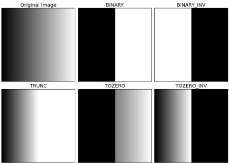

Values below 127 goes to 0 (black, everything above goes to 255 (white)

```python
adaptiveThreshold	(
	InputArray 	src,
	OutputArray 	dst,
	double 	maxValue,
	int 	adaptiveMethod,
	int 	thresholdType,
	int 	blockSize,
	double 	C 
)
```

```cpp
retval,img = threshold(	
	InputArray 	src,
	OutputArray dst,
	double 	thresh,
	double 	maxval,
	int type 
)	

# python
ret,thresh1 = cv2.threshold(src,thresh,maxval,cv2.type)
```

* src：源图像，可以为8位的灰度图，也可以为32位的彩色图像。（两者有区别
* dst：输出图像
* thresh：阈值
* maxval：dst图像中最大值
* type：阈值类型，可以具体类型如下：


图像

可视化


Otsu算法(大律法或最大类间方差法)

