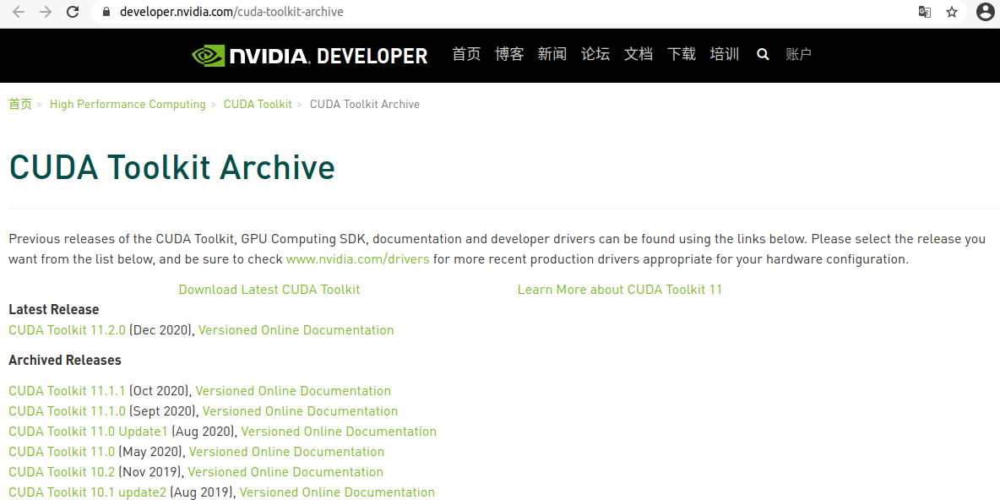
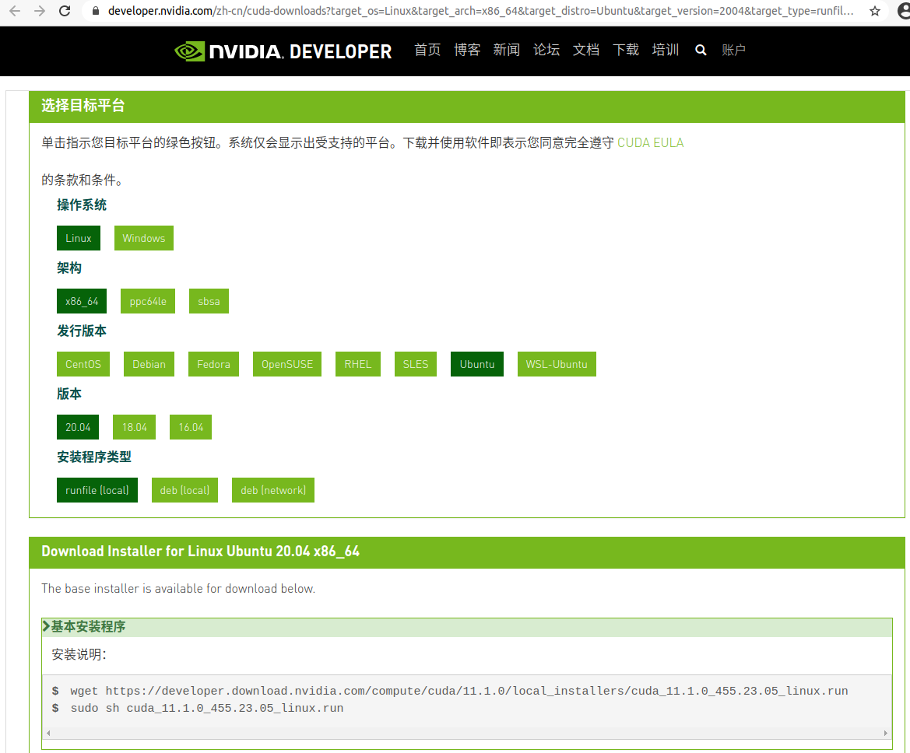

# Anaconda + CUDA 安装
{: id="20210120125837-d110pqb"}

{: id="20210121001219-bteuj7u"}

## Anaconda 安装配置
{: id="20210120230750-4mdkl8z"}

首先是miniconda的安装
{: id="20210120130012-lyar9jj"}

先去conda官网下载对应系统的[最新版本miniconda](https://docs.conda.io/en/latest/miniconda.html)，linux操作系统下载.sh的执行文件
{: id="20210120130030-6vxy9fx"}


{: id="20210120130150-mnqmpsh"}

命令行模式下给下载的文件执行权限,并执行
{: id="20210120223711-ceaqcit"}

```bash
sudo chmod +x filename.sh
# 执行当前目录下的filename.sh 脚本
./filename.sh
```
{: id="20210120223759-o2xkhnn"}

{: id="20210121001219-s5hczcq"}

根据提示安装好conda后，此时环境变量并没有配，需要手动把conda加入环境变量中即可
{: id="20210120224135-v3v6c33"}

linux 环境变量配置的地方有几处如 `~/.bashrc` 和`~/.profile`，个人建议装在profile中配置自己的环境变量。
{: id="20210120224232-278f3p2"}

```bash
$ echo 'export PATH="~/miniconda3/bin:$ PATH"' >> ~/.profile
$ source ~/.profile
# 一般conda默认安装在~/minicondaX 里，我这边修改后的示例为
# export PATH=$PATH:~/software/miniconda3/bin

# 之后执行 source指令激活修改后的环境变量
source ~/.profile
# 测试是否正常
conda env list
```
{: id="20210120224727-dmr9laa"}

{: id="20210121001219-3we7qoh"}

为了加速之后conda的下载速度，建议修改conda channel到国内的镜像源
{: id="20210120225530-a1gzcmk"}

```bash
# 首先生成conda配置文件
conda config

```
{: id="20210120230026-518ngb8"}

此时conda会在 自己用户目录下生成`/usr/login_name/.condarc` 也就是 `~/.condarc`文件
{: id="20210120230249-5sikk41"}

将配置文件里的内容修改为：
{: id="20210120230359-t63gl9f"}

```yml
show_channel_urls: true
channels:
  - https://mirrors.tuna.tsinghua.edu.cn/anaconda/cloud/pytorch/
  - https://mirrors.bfsu.edu.cn/anaconda/pkgs/main/
  - https://mirrors.bfsu.edu.cn/anaconda/pkgs/free/
  - http://mirrors.tuna.tsinghua.edu.cn/anaconda/cloud/msys2/
  - http://mirrors.tuna.tsinghua.edu.cn/anaconda/cloud/conda-forge
  - http://mirrors.tuna.tsinghua.edu.cn/anaconda/pkgs/free/
ssl_verify: true
```
{: id="20210120230506-c05rbrs"}

{: id="20210121001219-ipif4i4"}

此时conda的配置源基本处理结束，可以安装自己想用的内容了，
{: id="20210120230548-buu2j9f"}

### conda的常用基本命令
{: id="20210120230627-8p7typq"}

((20210110124639-ubr0y74 "{{.text}}"))
{: id="20210120230640-a379eqp"}

{: id="20210121001219-o7n3415"}

## CUDA 安装配置
{: id="20210120230741-ccsqxbq"}

安装cuda主要为了gpu可以参加深度学习的运算。
{: id="20210120232647-juf5je7"}

ubuntu20.04 tls只支持cuda11以上版本 所以目标安装cuda11.2最新版本,先是在nvidia官网的[cuda archived](https://developer.nvidia.com/cuda-toolkit-archive)中找到对于的版本，
{: id="20210120125843-e616g1f"}

{: id="20210121001219-rt7qnes"}

并在之后的选择器中选择对于要使用的程序，建议使用runfile本地安装的形式。
{: id="20210121001219-499ewck"}


{: id="20210121001555-yf62uje"}

之后就是执行对应的安装脚本了。
{: id="20210121001602-p45k38e"}

```bash
wget https://developer.download.nvidia.com/compute/cuda/11.1.0/local_installers/cuda_11.1.0_455.23.05_linux.run
sudo sh cuda_11.1.0_455.23.05_linux.run
```
{: id="20210121001632-brrgrrj"}

> wget 可以使用自己的节点加速下载
> {: id="20210121002115-msa3y6p"}
>
> 使用 wget -e "http_proxy=http://127.0.0.1" 下载地址即可
> {: id="20210121002129-17op5zo"}
>
> {: id="20210121002159-d8tqbvo"}
{: id="20210121002114-5s766zs"}

{: id="20210121004442-q2oowu5"}


{: id="20210120125837-xlp5tbq" type="doc"}
