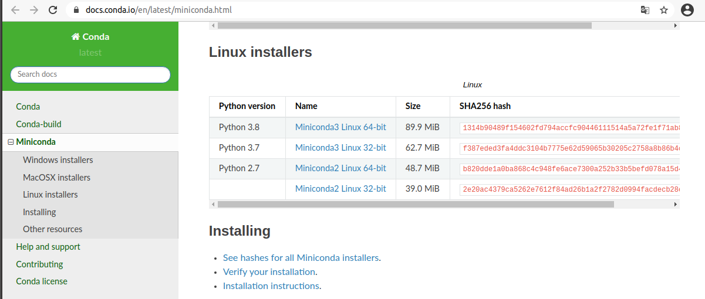
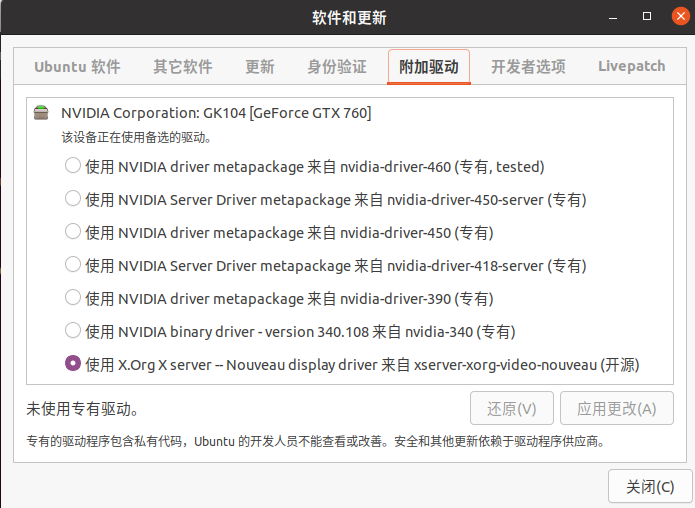
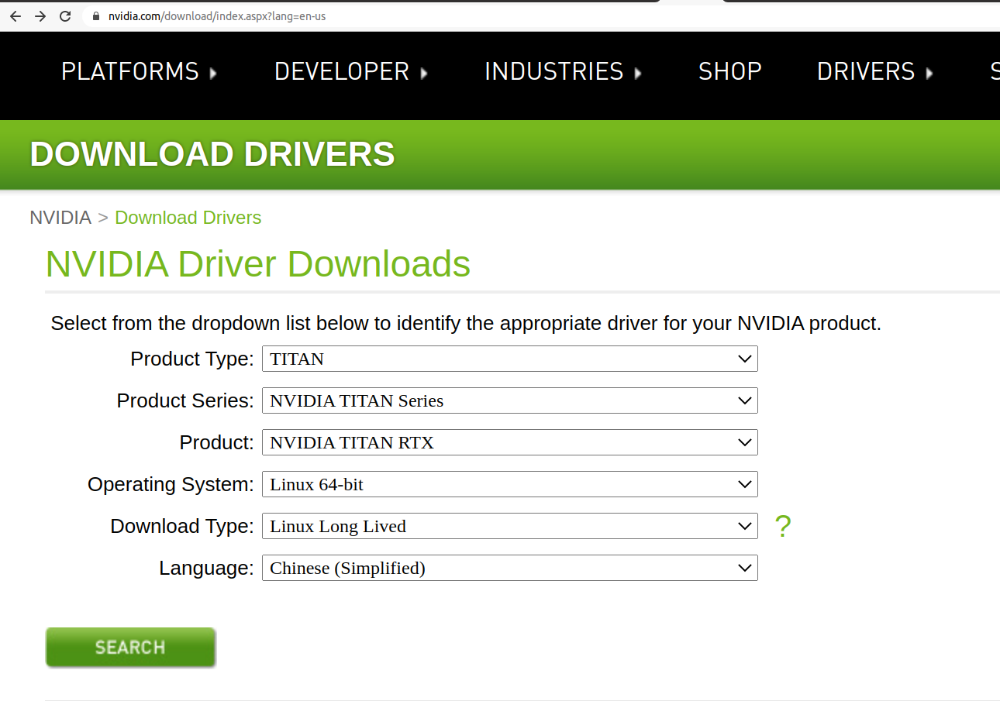
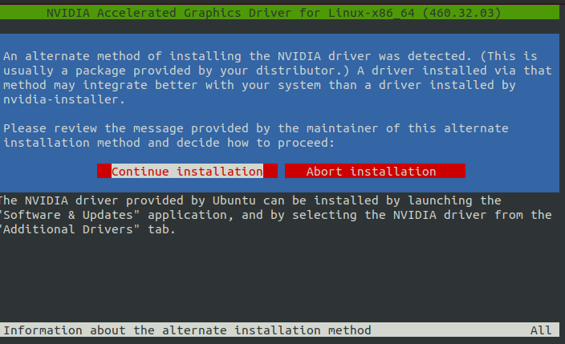
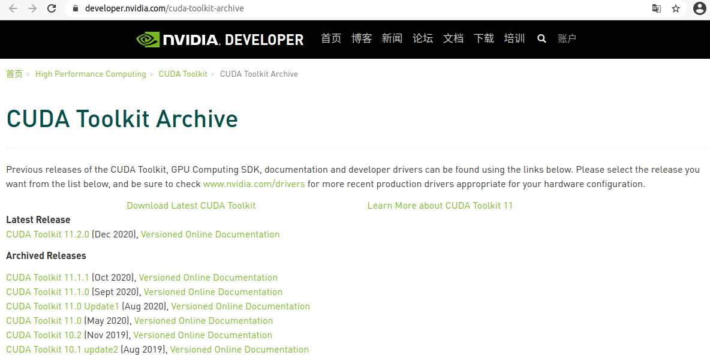
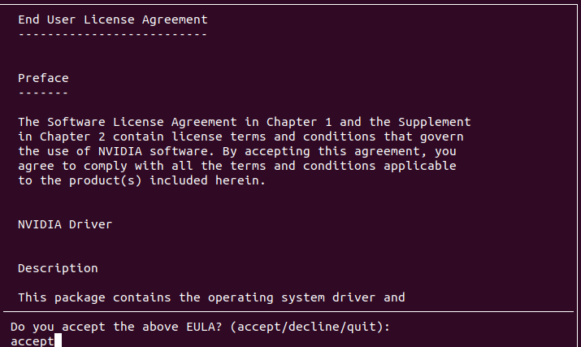
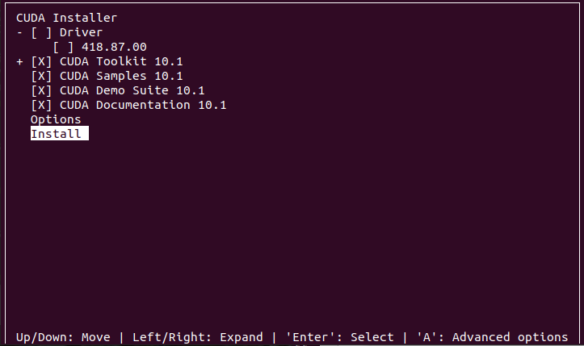
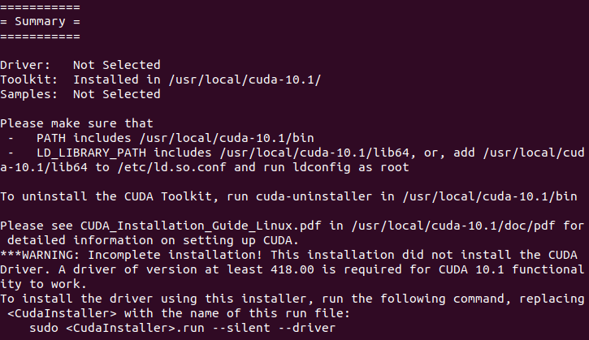
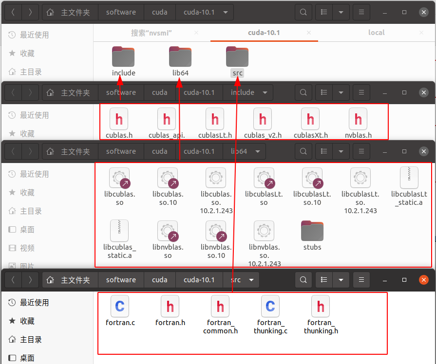
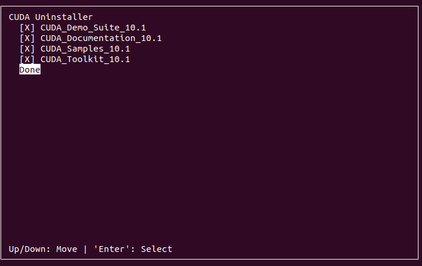

# Anaconda + CUDA 基础环境安装
{: id="20210120125837-d110pqb"}

## Anaconda 安装配置
{: id="20210120230750-4mdkl8z"}

首先是 miniconda 的安装
{: id="20210120130012-lyar9jj"}

先去 conda 官网下载对应系统的[最新版本 miniconda](https://docs.conda.io/en/latest/miniconda.html)，linux 操作系统下载.sh 的执行文件
{: id="20210120130030-6vxy9fx"}


{: id="20210120130150-mnqmpsh"}

命令行模式下给下载的文件执行权限,并执行
{: id="20210120223711-ceaqcit"}

```bash
sudo chmod +x filename.sh
# 执行当前目录下的filename.sh 脚本
./filename.sh
```
{: id="20210120223759-o2xkhnn"}

根据提示安装好 conda 后，此时环境变量并没有配，需要手动把 conda 加入环境变量中即可
{: id="20210120224135-v3v6c33"}

linux 环境变量配置的地方有几处如 `~/.bashrc` 和 `~/.profile`，个人建议装在 profile 中配置自己的环境变量。
{: id="20210120224232-278f3p2"}

```bash
$ echo 'export PATH="~/miniconda3/bin:$ PATH"' >> ~/.profile
$ source ~/.profile
# 一般conda默认安装在~/minicondaX 里，我这边修改后的示例为
# export PATH=$PATH:~/software/miniconda3/bin

# 之后执行 source指令激活修改后的环境变量
source ~/.profile
# 测试是否正常
conda env list
```
{: id="20210120224727-dmr9laa"}

为了加速之后 conda 的下载速度，建议修改 conda channel 到国内的镜像源
{: id="20210120225530-a1gzcmk"}

```bash
# 首先生成conda配置文件
conda config

```
{: id="20210120230026-518ngb8"}

此时 conda 会在 自己用户目录下生成 `/usr/login_name/.condarc` 也就是 `~/.condarc` 文件
{: id="20210120230249-5sikk41"}

将配置文件里的内容修改为：
{: id="20210120230359-t63gl9f"}

```yml
show_channel_urls: true
channels:
  - https://mirrors.tuna.tsinghua.edu.cn/anaconda/cloud/pytorch/
  - https://mirrors.bfsu.edu.cn/anaconda/pkgs/main/
  - https://mirrors.bfsu.edu.cn/anaconda/pkgs/free/
  - http://mirrors.tuna.tsinghua.edu.cn/anaconda/cloud/msys2/
  - http://mirrors.tuna.tsinghua.edu.cn/anaconda/cloud/conda-forge
  - http://mirrors.tuna.tsinghua.edu.cn/anaconda/pkgs/free/
ssl_verify: true
```
{: id="20210120230506-c05rbrs"}

此时 conda 的配置源基本处理结束，可以安装自己想用的内容了，
{: id="20210120230548-buu2j9f"}

### conda 的常用基本命令
{: id="20210120230627-8p7typq"}

((20210110124639-ubr0y74 "{{.text}}"))
{: id="20210120230640-a379eqp"}

## CUDA 安装配置
{: id="20210120230741-ccsqxbq"}

安装 cuda 主要为了 gpu 可以参加深度学习的运算。
{: id="20210120232647-juf5je7"}

### NVIDIA 驱动
{: id="20210123012647-w6zmo1x"}

对于 CUDA 安装首先是要确认机器是否可以安装 CUDA，使用以下命令显示自己的 nivida 显卡信息，并对比显卡
{: id="20210121181431-ttlulh0"}

是否在对应
{: id="20210121181900-4o4rpz1"}

```bash
lspci | grep -i nvidia
nvidia-smi
```
{: id="20210121181454-ih0mdl1"}

如果没有任何显示，或者在软件与更新中检查自己是否安装 nvdia 驱动,则更新下自己的驱动
{: id="20210121181514-3g9knnm"}


{: id="20210123012538-lf10znj"}

可以直接使用 `software&update` 这个内置应用来更新驱动,也可以直接使用 apt-get install 的方式安装 nvidia 驱动,由于比较简单,这里介绍一个比较复杂的方式.
{: id="20210123021124-ftpfkyu"}

#### 手动安装 nvidia 驱动
{: id="20210122235639-thbn7l7"}

这里推荐手动下载 nvidia 驱动,[驱动官网](https://www.nvidia.com/download/index.aspx?lang=en-us):https://www.nvidia.com/download/index.aspx?lang=en-us
{: id="20210123021303-0336zad"}


{: id="20210123003810-8ce0cpv"}

Nvidia 驱动安装需要用到 make 命令
{: id="20210123020024-vqf6xq0"}

```bash
sudo apt-get install make
```
{: id="20210123020050-9aoo61f"}

下载之后 通过 Ctrl+Alt+F3 切换到文字界面安装驱动, 执行对应的驱动文件即可
{: id="20210123004045-0yc1hji"}

```bash
sudo sh dirve-file-path.run -no-x-check -no-nouveau-check -no-opengl-files
```
{: id="20210123004106-opwmokr"}

只有禁用 opengl 这样安装才不会出现循环登陆的问题
{: id="20210123015850-scbgz4r"}

* {: id="20210123015858-zg8rv3x"}-no-x-check：安装驱动时关闭 X 服务
* {: id="20210123015904-72im7c6"}-no-nouveau-check：安装驱动时禁用 nouveau
* {: id="20210123015908-dbyoc51"}-no-opengl-files：只安装驱动文件，不安装 OpenGL 文件
{: id="20210123015850-epkfhgc"}

安装会像这样
{: id="20210123021124-qgw4vir"}


{: id="20210123021425-fqm8ovx"}

基本全部默认即可,直接正常安装.
{: id="20210123021124-iizmxd2"}

如果遇到 gcc 版本检测失败,建议退出重新安装 gcc 以保证编译核心与系统兼容.
{: id="20210123021456-b2u0edt"}

{: id="20210123021826-zpepk62"}

安装完毕后,使用命令 `nvidia-smi` 即可看到自己的驱动信息
{: id="20210123021825-l3r91ly"}

```shell
(base) vase@vase:~$ nvidia-smi
Sat Jan 23 02:10:00 2021   
+-----------------------------------------------------------------------------+
| NVIDIA-SMI 460.32.03    Driver Version: 460.32.03    CUDA Version: 11.2     |
|-------------------------------+----------------------+----------------------+
| GPU  Name        Persistence-M| Bus-Id        Disp.A | Volatile Uncorr. ECC |
| Fan  Temp  Perf  Pwr:Usage/Cap|         Memory-Usage | GPU-Util  Compute M. |
|                               |                      |               MIG M. |
|===============================+======================+======================|
|   0  GeForce GTX 960     Off  | 00000000:0A:00.0 N/A |                  N/A |
| 47%   31C    P8    N/A /  N/A |     47MiB /  1996MiB |     N/A      Default |
|                               |                      |                  N/A |
+-------------------------------+----------------------+----------------------+
                                                                         
+-----------------------------------------------------------------------------+
| Processes:                                                                  |
|  GPU   GI   CI        PID   Type   Process name                  GPU Memory |
|        ID   ID                                                   Usage      |
|=============================================================================|
|  No running processes found                                                 |
+-----------------------------------------------------------------------------+

```
{: id="20210123021901-2tyozvo"}

{: id="20210123021708-96v65m1"}

### GCC + G++ 编译器
{: id="20210123012640-tm3ck1f"}

一般来说 cuda 均需要 gcc 和 g++ 的支持，所以在执行给定脚本前，先安装好 g++ 和 gcc
{: id="20210121182903-8mnxw5g"}

```bash
sudo apt-get install gcc g++
```
{: id="20210121181804-ipdmsni"}

值得注意的是 ubuntu20.04 安装的 gcc 默认版本是 9.x，但是 cuda10.1 并不支持 gcc9.x 版本，需要自己
{: id="20210121183009-nwmovh3"}

->((20210121183236-qx9uelp "手动安装低版本的 gcc")) <-。
{: id="20210121183718-jz7hgib"}

{: id="20210123021124-zxumjvg"}

### CUDA 脚本 下载与安装
{: id="20210123012206-diil5mz"}

ubuntu20.04 tls 只支持 cuda11 以上版本 所以目标安装 cuda11.2 最新版本,先是在 nvidia 官网的 [cuda archived](https://developer.nvidia.com/cuda-toolkit-archive) 中找到对于的版本，可以使用 `uname -m && cat /etc/*release` 查看自己的系统信息。
{: id="20210120125843-e616g1f"}

并在之后的选择器中选择对于要使用的程序，建议使用 runfile 本地安装的形式。
{: id="20210121001219-499ewck"}


{: id="20210121105111-fwa8bap"}

{: id="20210123021124-pbjloxs"}

之后就是执行对应的安装脚本了。
{: id="20210121001602-p45k38e"}

```bash
wget https://developer.download.nvidia.com/compute/cuda/11.1.0/local_installers/cuda_11.1.0_455.23.05_linux.run
sudo sh cuda_11.1.0_455.23.05_linux.run
```
{: id="20210121001632-brrgrrj"}

> wget 可以使用自己的节点加速下载
> {: id="20210121002115-msa3y6p"}
>
> 使用 wget -e "http_proxy=http://127.0.0.1" 下载地址即可
> {: id="20210121002129-17op5zo"}
{: id="20210121002114-5s766zs"}

接受 cuda 的 license
{: id="20210122230835-ooi8j8b"}


{: id="20210122230622-8j2uubk"}

{: id="20210123021124-hnsov1n"}

这里选择号自己要安装的内容,CUDA Toolkit 为必须安装内容,其他的根据自己选择进行安装,一般桌面版的 ubuntu 第一个驱动都不装(因为自己以及装过了)
{: id="20210122230622-dvbvdaz"}


{: id="20210122231010-bi16rmf"}

[其中 cuda 安装所作的主要是以下的工作](https://www.pugetsystems.com/labs/hpc/How-To-Install-CUDA-10-1-on-Ubuntu-19-04-1405/):
{: id="20210123000057-j1m0171"}

* {: id="20210123000149-7fvjkql"}安装 cuda toolkit 到/usr/local/cuda-version
* {: id="20210123000151-4m8p8iz"}创建软连接到/usr/local/cuda
* {: id="20210123000219-9z1p11f"}安装 cuda 示例到/usr/local/cuda/samples 和 home 文件夹下的 NVIDIA_CUDA-10.1_Samples
* {: id="20210123000316-ylf0we3"}添加 cuda 的 library path
{: id="20210123000124-pct9dmi"}

看到以下则表示安装正常:
{: id="20210122235746-8dg7rmq"}


{: id="20210122235755-3auqfmv"}

配置一下环境变量
{: id="20210122235639-vpu1jqh"}

{: id="20210123021124-ey8l0kf"}

```bash
echo "export PATH=\"\$PATH:/usr/local/cuda/bin\"" >> ~/.profile

source ~/.profile
```
{: id="20210123001958-jderxr9"}

之后使用 ncvv -V 检查下 CUDA 环境即可
{: id="20210123002124-prk491v"}

```shell
(base) vase@vase:~/software/YesPlayMusic$ nvcc -V
nvcc: NVIDIA (R) Cuda compiler driver
Copyright (c) 2005-2019 NVIDIA Corporation
Built on Sun_Jul_28_19:07:16_PDT_2019
Cuda compilation tools, release 10.1, V10.1.243
```
{: id="20210123002831-cudu5la"}

{: id="20210123021124-5il15oz"}

### ubuntu20.04 安装 cuda10.1
{: id="20210123002124-g9z3cjw"}

正常是无法安装的,为此我们需要先将 gcc,g++ 降级, 才可以正常的运行,值得注意的是,在安装 cuda10.1 时,由于未知原因,在安装前要指定好 cuda 的库文件 即通过 `--liberarypath=/usr/local/cuda-10.1`
{: id="20210123004707-vy7eilm"}

即运行指令
{: id="20210123005338-fn0oyfz"}

```bash
sudo sh cuda_10.1.*.run --librarypath=/usr/local/cuda-10.1
```
{: id="20210123005345-m4m40ro"}

> 这里更改库地址为其他并不会影响 cuda 的安装,但是建议和 cuda 主文件安装在一起
> {: id="20210123005527-gvs4o0e"}
{: id="20210123005524-ei5gx7g"}

{: id="20210123021124-emjat8z"}

conda 的库文件如下:
{: id="20210123004947-3o1dgfp"}


{: id="20210123005310-06juegm"}

{: id="20210123021124-8z056eb"}

{: id="20210123021124-2vjukqq"}

### CUDA 卸载
{: id="20210121182748-lge95v6"}

对于 cuda 卸载官方给出过脚本，只需要执行对于 cuda 文件中的 sh 文件即可
{: id="20210121184045-yu55a1c"}

一般为 cuda 目录下的 bin 文件夹里的 cuda-uninstaller,即运行
{: id="20210122235639-ltzyjxn"}

```bash
cd /usr/local/conda/bin

sudo sh ./cuda-uninstaller
```
{: id="20210123005857-70lcuxm"}

{: id="20210123021124-9lv9qrs"}

对于一些低版本 cuda 可能用的.pl 执行文件,具体为
{: id="20210123010037-j2b2z2q"}

```bash
# x.x 为自己的具体版本
sudo /usr/local/cuda-x.x/bin/uninstall_cuda_x.x.pl
```
{: id="20210123010112-3bb3l5n"}


{: id="20210123010052-txe40gq"}

{: id="20210123021124-hdv4s5m"}

检查是否卸载干净直接去/usr/local 看看有无残留 cuda 文件即可
{: id="20210123011751-gm3jwmc"}


{: id="20210120125837-xlp5tbq" type="doc"}
