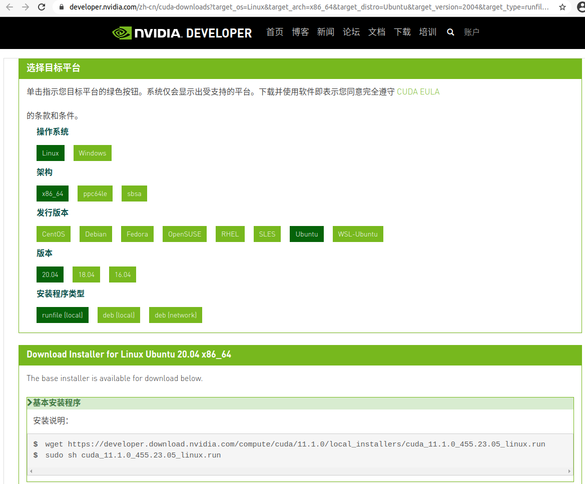

# Anaconda + CUDA 基础环境安装
{: id="20210120125837-d110pqb"}

## Anaconda 安装配置
{: id="20210120230750-4mdkl8z"}

首先是 miniconda 的安装
{: id="20210120130012-lyar9jj"}

先去 conda 官网下载对应系统的[最新版本 miniconda](https://docs.conda.io/en/latest/miniconda.html)，linux 操作系统下载.sh 的执行文件
{: id="20210120130030-6vxy9fx"}


{: id="20210120130150-mnqmpsh"}

命令行模式下给下载的文件执行权限,并执行
{: id="20210120223711-ceaqcit"}

```bash
sudo chmod +x filename.sh
# 执行当前目录下的filename.sh 脚本
./filename.sh
```
{: id="20210120223759-o2xkhnn"}

根据提示安装好 conda 后，此时环境变量并没有配，需要手动把 conda 加入环境变量中即可
{: id="20210120224135-v3v6c33"}

linux 环境变量配置的地方有几处如 `~/.bashrc` 和 `~/.profile`，个人建议装在 profile 中配置自己的环境变量。
{: id="20210120224232-278f3p2"}

```bash
$ echo 'export PATH="~/miniconda3/bin:$ PATH"' >> ~/.profile
$ source ~/.profile
# 一般conda默认安装在~/minicondaX 里，我这边修改后的示例为
# export PATH=$PATH:~/software/miniconda3/bin

# 之后执行 source指令激活修改后的环境变量
source ~/.profile
# 测试是否正常
conda env list
```
{: id="20210120224727-dmr9laa"}

为了加速之后 conda 的下载速度，建议修改 conda channel 到国内的镜像源
{: id="20210120225530-a1gzcmk"}

```bash
# 首先生成conda配置文件
conda config

```
{: id="20210120230026-518ngb8"}

此时 conda 会在 自己用户目录下生成 `/usr/login_name/.condarc` 也就是 `~/.condarc` 文件
{: id="20210120230249-5sikk41"}

将配置文件里的内容修改为：
{: id="20210120230359-t63gl9f"}

```yml
show_channel_urls: true
channels:
  - https://mirrors.tuna.tsinghua.edu.cn/anaconda/cloud/pytorch/
  - https://mirrors.bfsu.edu.cn/anaconda/pkgs/main/
  - https://mirrors.bfsu.edu.cn/anaconda/pkgs/free/
  - http://mirrors.tuna.tsinghua.edu.cn/anaconda/cloud/msys2/
  - http://mirrors.tuna.tsinghua.edu.cn/anaconda/cloud/conda-forge
  - http://mirrors.tuna.tsinghua.edu.cn/anaconda/pkgs/free/
ssl_verify: true
```
{: id="20210120230506-c05rbrs"}

此时 conda 的配置源基本处理结束，可以安装自己想用的内容了，
{: id="20210120230548-buu2j9f"}

### conda 的常用基本命令
{: id="20210120230627-8p7typq"}

((20210110124639-ubr0y74 "{{.text}}"))
{: id="20210120230640-a379eqp"}

## CUDA 安装配置
{: id="20210120230741-ccsqxbq"}

安装 cuda 主要为了 gpu 可以参加深度学习的运算。
{: id="20210120232647-juf5je7"}

对于 CUDA 安装首先是要确认机器是否可以安装 CUDA，使用以下命令显示自己的 nivida 显卡信息，并对比显卡
{: id="20210121181431-ttlulh0"}

是否在对应
{: id="20210121181900-4o4rpz1"}

```bash
lspci | grep -i nvidia
```
{: id="20210121181454-ih0mdl1"}

如果没有任何显示，则更新下自己的驱动
{: id="20210121181514-3g9knnm"}

```bash
update-pciids
```
{: id="20210121181634-winl5ew"}

{: id="20210122225943-ixptosf"}

一般来说 cuda 均需要 gcc 和 g++ 的支持，所以在执行给定脚本前，先安装好 g++ 和 gcc
{: id="20210121182903-8mnxw5g"}

```bash
sudo apt-get install gcc g++
```
{: id="20210121181804-ipdmsni"}

值得注意的是 ubuntu20.04 安装的 gcc 默认版本是 9.x，但是 cuda10.1 并不支持 gcc9.x 版本，需要自己
{: id="20210121183009-nwmovh3"}

->((20210121183236-qx9uelp "手动安装低版本的 gcc")) <-。
{: id="20210121183718-jz7hgib"}

ubuntu20.04 tls 只支持 cuda11 以上版本 所以目标安装 cuda11.2 最新版本,先是在 nvidia 官网的 [cuda archived](https://developer.nvidia.com/cuda-toolkit-archive) 中找到对于的版本，可以使用 `uname -m && cat /etc/*release` 查看自己的系统信息。
{: id="20210120125843-e616g1f"}

并在之后的选择器中选择对于要使用的程序，建议使用 runfile 本地安装的形式。
{: id="20210121001219-499ewck"}


{: id="20210121001555-yf62uje"}


{: id="20210121105111-fwa8bap"}

{: id="20210122225943-oto9y8h"}

之后就是执行对应的安装脚本了。
{: id="20210121001602-p45k38e"}

```bash
wget https://developer.download.nvidia.com/compute/cuda/11.1.0/local_installers/cuda_11.1.0_455.23.05_linux.run
sudo sh cuda_11.1.0_455.23.05_linux.run
```
{: id="20210121001632-brrgrrj"}

> wget 可以使用自己的节点加速下载
> {: id="20210121002115-msa3y6p"}
>
> 使用 wget -e "http_proxy=http://127.0.0.1" 下载地址即可
> {: id="20210121002129-17op5zo"}
{: id="20210121002114-5s766zs"}

{: id="20210122225943-s4drs38"}

### CUDA 卸载
{: id="20210121182748-lge95v6"}

对于 cuda 卸载官方给出过脚本，只需要执行对于 cuda 文件中的 sh 文件即可
{: id="20210121184045-yu55a1c"}

{: id="20210122225943-ke1uz66"}


{: id="20210120125837-xlp5tbq" type="doc"}
