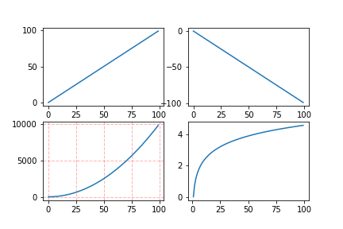

> figure(num=None, figsize=None, dpi=None, facecolor=None, edgecolor=None, frameon=True)

* num:图像编号或名称，数字为编号 ，字符串为名称
  figsize:指定figure的宽和高，单位为英寸；
  dpi参数指定绘图对象的分辨率，即每英寸多少个像素，缺省值为80      1英寸等于2.5cm,A4纸是 21*30cm的纸张
  facecolor:背景颜色
  edgecolor:边框颜色
  frameon:是否显示边框

> subplot(nrows,ncols,sharex,sharey,subplot_kw,**fig_kw)
> subplot可以规划figure划分为n个子图，但每条subplot命令只会创建一个子图 ，参考下面例子。

* nrows 行数
* ncolos 列数
* 所有子图使用相同的x刻度 sharex
* 所有子图使用相同的y刻度 sharey
* 创建子图的关键词字典 subplot_kw
* 子图的其他关键字 如/ plt.subplots(2,2,figure=(6,6))

subplot 画子图的几种方法

```python
# method 1
x = np.arange(1, 50)
#作图1
plt.subplot(2,2,1)  
plt.plot(x, x)  
#作图2
plt.subplot(2,2,2)  
plt.plot(x, -x)  
 #作图3
plt.subplot(223)  
plt.plot(x, x ** 2)  
plt.grid(color='r', linestyle='--', linewidth=1,alpha=0.3)
#作图4
plt.subplot(224)  
plt.plot(x, np.log(x))
plt.show()  
```

```python
#method 2
x = np.arange(1, 50) 
#划分子图
fig,axes=plt.subplots(2,2)
ax1=axes[0,0]
ax2=axes[0,1]
ax3=axes[1,0]
ax4=axes[1,1]
#作图1
ax1.plot(x, x)  
#作图2
ax2.plot(x, -x)
 #作图3
ax3.plot(x, x ** 2)
ax3.grid(color='r', linestyle='--', linewidth=1,alpha=0.3)
#作图4
ax4.plot(x, np.log(x))  
plt.show() 
```

> 

### draw

```python
plt.figure(figsize=(20,20))
ax2 = plt.subplot(121)
plt.title("bbox vision")
ax2.axis([0,20,30,0])
#[2,o]
#[o,1] ax.axis 是一个正常理解的坐标系 ，左下角为(0,0)坐标
#而图像中 左上角才为(0,0)坐标
ax2.add_patch(plt.Rectangle(xy=[x1, y1, x2, y2],box_w,box_h,edgecolor=r_color,linewidth=2,fill=False))


```
