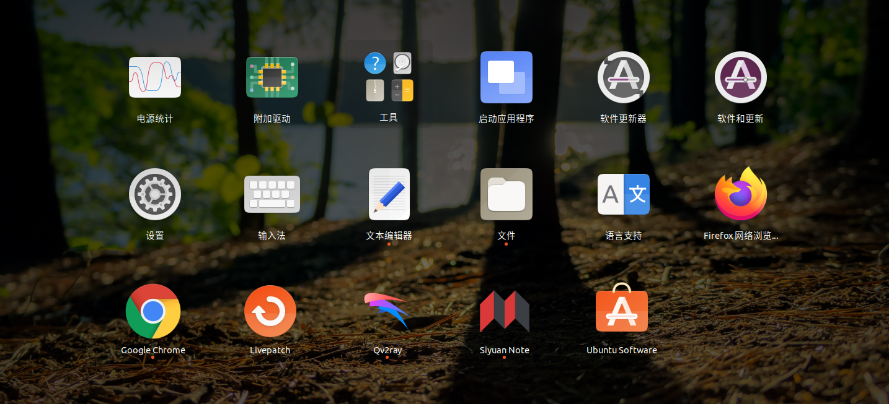

# 创建桌面快捷方式
{: id="20210110115305-sk4ueih"}

对于ubuntu来说，有很多的应用都是通过termail直接执行，需要重复进入文件夹在进行命令行打开。
{: id="20210110115316-id69ba7"}

我们可以在桌面创建对应的快捷方式来达到和mac相似的效果。
{: id="20210110115404-ah33g7g"}

我们要知道的是，ubuntu桌面应用的存储地址在:
{: id="20210110115429-sj50ody"}

> /usr/share/applications
> {: id="20210110115459-k6p42o9"}
{: id="20210110115458-m7y72p1"}

我们可以直接使用`sudo vi softname.desktop`的命名创建名称为.desktop的快捷方式。
{: id="20210110115533-vhn2k7k"}

其内容为
{: id="20210110115630-41f1zs8"}

```bash
[Desktop Entry]
Version=1.0
# 软件名
Name=Siyuan Note
# Only KDE 4 seems to use GenericName, so we reuse the KDE strings.
# From Ubuntu's language-pack-kde-XX-base packages, version 9.04-20090413.
GenericName=NoteBook
# 中文环境下的软件名
GenericName[zh_CN]=思源笔记本、

# 软件类型
Type=Application
# 软件图标
Icon=/home/vase/software/SiYuan/icon.png
# 软件所执行的应用
Exec=/home/vase/software/SiYuan/siyuan
# 软件是否使用命令行
Terminal= true
# 软件是否发送通知
StartupNotify=false
```
{: id="20210110115635-4mvvgan"}

直接保存，我们就可以在桌面看到对于的文件了
{: id="20210110115515-o234dhb"}


{: id="20210110115923-zh60p8n"}

{: id="20210110115305-wmi5k85" type="doc"}
