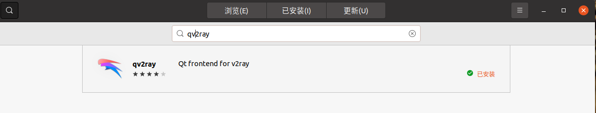
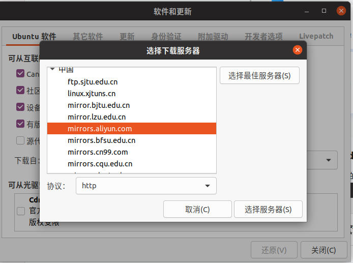
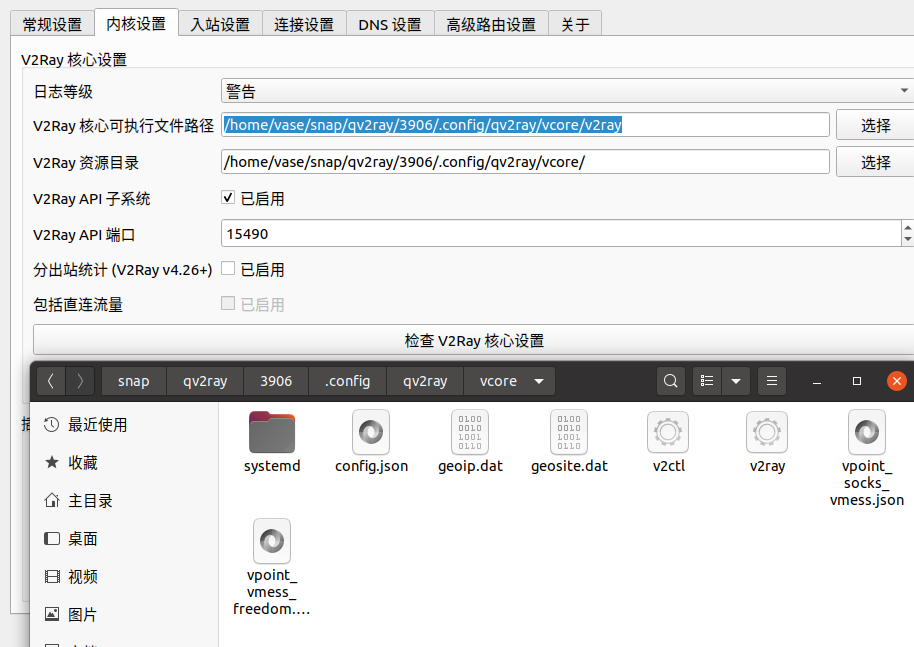

# clash install and using
{: id="20210110110411-hvy77mm"}

首先是下载 [clash for linux](https://github.com/Dreamacro/clash/releases) https://github.com/Dreamacro/clash/releases
{: id="20210110110422-o030uxw"}

安装好后放到自己软件的文件夹 如/home/username/software/clash
{: id="20210110110422-9leo8q7"}

在对应的 clash 文件夹下解压对应的压缩包 如下命令：` gzip -d 'clash.gz'`。
{: id="20210110110422-14hr156"}

此时 clash 文件并没有权限，将 clash 整个文件夹赋予执行权限：`chmod +x ./clash`。
{: id="20210110110422-ocac7rr"}

之后在解压好的文件夹下尝试运行 clash ：` ./clash`。
{: id="20210110110422-fy1gm8h"}

当提示
{: id="20210110110422-w1ixruh"}

> INFO[0022] HTTP proxy listening at :127.0.0.1:7890
> {: id="20210110110422-hfhyu0r"}
>
> INFO[0000] SOCKS proxy listening at : 127.0.0.1:7891
> {: id="20210110110422-zj0o4a7"}
>
> INFO[0000] RESTFul API listening at:127.0.0.1:9090
> {: id="20210110110422-fi6gx2p"}
{: id="20210110110422-p44soz2"}

则表示 clash 正常安装并打开了。
{: id="20210110110422-kqdvr2i"}

当然配置文件为你在其他平台购买的配置文件，如果第一次没有配置文件会自动生产默认的配置文件，如果系统中没有 MMDB，clash 会自行进行下载和安装。
{: id="20210110110422-mje5nue"}


{: id="20210110110422-83h8uzf"}

在正式使用 clash 前，我们需要配置对应的 clash 代理端口和 clash 的配置文件，之后在文件夹下放好对应的 config.yaml。注意  此时 clash 的配置文件目录在 `~/.config/clash` 下。
{: id="20210110110422-q2x5upn"}

重新启动 clash 即可通过 [clash 控制台](https://clash.razord.top/#/settings)：clash.razord.top/ 进入控制面板进行操作。
{: id="20210110110422-qgsw0yd"}

注意控制台输入的端口与给出的'restful API '一致才可登陆正常
{: id="20210110110422-z3hwy2f"}


{: id="20210110110422-qi0ef70"}

#### Qv2ray install and using
{: id="20210110110422-ffkz9va"}

Qv2ray 相对于 clash 有具体的图形界面，并且可以在 ubuntu 中下载并使用
{: id="20210110110422-gkhul65"}

安装前建议修改 ubuntu 的 software 镜像原，改为 aliyun 的会快不少。
{: id="20210120234406-soc8rus"}

安装好 qv2ray 后，我们需要对其 v2ray 核心进行配置，首先是下载 [v2ray-core](https://hub.fastgit.org/v2fly/v2ray-core/releases):https://hub.fastgit.org/v2fly/v2ray-core/releases
{: id="20210110110422-au17wms"}

下载后解压到对应的 qv2ray 核心中，如
{: id="20210110110422-icvse1l"}

检查 v2ray 核心设置是否正确后就可以正常使用了。
{: id="20210110110422-usiohqd"}

{: id="20210121235842-y4p33gx"}

### 服务器配置 v2ray
{: id="20210121235838-gtwjlub"}

对服务器一定要进行时区的调整,否则会因为时区的时间差异无法连接服务器
{: id="20210122002735-0ivccgj"}

Debian10 下进行修改:
{: id="20210122002806-j5sw2n3"}

```bash
date 查看当前的系统时间
date -R 可查看时区 不是08区，则更新时区

执行 echo "export TZ='Asia/Shanghai'"  >> /etc/profile && source /etc/profile && hwclock -w

再次查看时间
date -R
hwclock
```
{: id="20210122002941-126jcap"}


{: id="20210122003414-bxmknbq"}

对服务器进行测速
{: id="20210122003412-ig9lv6g"}

```bash
wget https://raw.github.com/sivel/speedtest-cli/master/speedtest.py
chmod a+rx speedtest.py
mv speedtest.py /usr/local/bin/speedtest
chown root:root /usr/local/bin/speedtest
speedtest
```
{: id="20210122003421-enppb7q"}


{: id="20210122003412-1hgemyo"}

这里直接使用开源的一键脚本:
{: id="20210121235853-o1t4o23"}

[Linux-NetSpeed](https://github.com/chiakge/Linux-NetSpeed):https://github.com/chiakge/Linux-NetSpeed
{: id="20210121235930-ly83dxm"}

[multi-v2ray](https://github.com/Jrohy/multi-v2ray):https://github.com/ylx2016/Linux-NetSpeed
{: id="20210121235947-27se3nx"}

```bash
# 进行锐速调整
wget -N "https://github.000060000.xyz/tcpx.sh" && chmod +x tcpx.sh && ./tcpx.sh
# 安装V2ray
source <(curl -sL https://multi.netlify.app/v2ray.sh) --zh

# 升级命令(保留配置文件更新)
source <(curl -sL https://multi.netlify.app/v2ray.sh) -k

# 卸载命令
source <(curl -sL https://multi.netlify.app/v2ray.sh) --remove
{: id="20210122000014-02q1xjs"}


{: id="20210122000230-y614i2t"}

参数操作:
{: id="20210122000229-i99ksm4"}

```bash
v2ray/xray [-h|help] [options]
    -h, help             查看帮助
    -v, version          查看版本号
    start                启动 V2Ray
    stop                 停止 V2Ray
    restart              重启 V2Ray
    status               查看 V2Ray 运行状态
    new                  重建新的v2ray json配置文件
    update               更新 V2Ray 到最新Release版本
    update [version]     更新 V2Ray 到指定版本
    update.sh            更新 multi-v2ray 到最新版本
    add                  新增端口组
    add [protocol]       新增一种协议的组, 端口随机, 如 v2ray add utp 为新增utp协议
    del                  删除端口组
    info                 查看配置
    port                 修改端口
    tls                  修改tls
    tfo                  修改tcpFastOpen
    stream               修改传输协议
    cdn                  走cdn
    stats                v2ray流量统计
    iptables             iptables流量统计
    clean                清理日志
    log                  查看日志
    rm                   卸载core
```
{: id="20210122000145-d87n0ll"}

{: id="20210122002100-8rczva3"}

{: id="20210122002101-bsioflz"}

```
apt-get install gnupg1 apt-transport-https dirmngr
export INSTALL_KEY=379CE192D401AB61
apt-key adv --keyserver keyserver.ubuntu.com --recv-keys $INSTALL_KEY
echo "deb https://ookla.bintray.com/debian generic main" | tee  /etc/apt/sources.list.d/speedtest.list
apt-get update
apt-get install speedtest
```
{: id="20210122000145-fmdvspc"}

{: id="20210122031603-dnaeob3"}

{: id="20210122031607-afeseiw"}

### v2ray 自建
{: id="20210122031607-w60dq2k"}

建议使用 websocket 进行链接,安全性对比 tcp 高不少,要求更高的安全性可以选择 ws+tls 的 https 证书形式
{: id="20210122031613-ww93nrq"}

{: id="20210122031859-txofqcv"}

{: id="20210122031634-pfzjz8n"}


{: id="20210110110411-eb83f2v" type="doc"}
