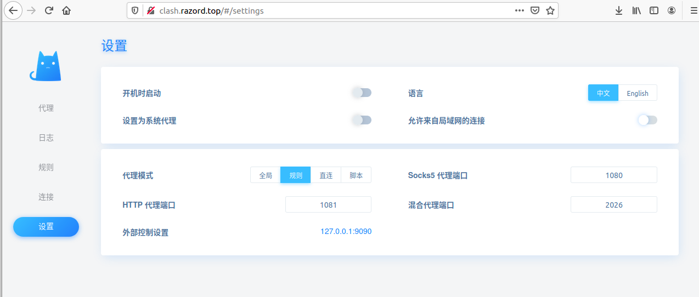

# clash install and using
{: id="20210110110411-hvy77mm"}

首先是下载[clash for linux](https://github.com/Dreamacro/clash/releases) https://github.com/Dreamacro/clash/releases
{: id="20210110110422-o030uxw"}

安装好后放到自己软件的文件夹 如/home/username/software/clash
{: id="20210110110422-9leo8q7"}

在对应的 clash 文件夹下解压对应的压缩包 如下命令：` gzip -d 'clash.gz'`。
{: id="20210110110422-14hr156"}

此时 clash 文件并没有权限，将 clash 整个文件夹赋予执行权限：`chmod +x ./clash`。
{: id="20210110110422-ocac7rr"}

之后在解压好的文件夹下尝试运行 clash ：` ./clash`。
{: id="20210110110422-fy1gm8h"}

当提示
{: id="20210110110422-w1ixruh"}

> INFO[0022] HTTP proxy listening at :127.0.0.1:7890
> {: id="20210110110422-hfhyu0r"}
>
> INFO[0000] SOCKS proxy listening at : 127.0.0.1:7891
> {: id="20210110110422-zj0o4a7"}
>
> INFO[0000] RESTFul API listening at:127.0.0.1:9090
> {: id="20210110110422-fi6gx2p"}
{: id="20210110110422-p44soz2"}

则表示 clash 正常安装并打开了。
{: id="20210110110422-kqdvr2i"}

当然配置文件为你在其他平台购买的配置文件，如果第一次没有配置文件会自动生产默认的配置文件，如果系统中没有 MMDB，clash 会自行进行下载和安装。
{: id="20210110110422-mje5nue"}

{: id="20210110110422-83h8uzf"}

在正式使用 clash 前，我们需要配置对应的 clash 代理端口和 clash 的配置文件，之后在文件夹下放好对应的 config.yaml。注意  此时 clash 的配置文件目录在`~/.config/clash`下。
{: id="20210110110422-q2x5upn"}

重新启动 clash 即可通过[clash 控制台](https://clash.razord.top/#/settings)：clash.razord.top/ 进入控制面板进行操作。
{: id="20210110110422-qgsw0yd"}

注意控制台输入的端口与给出的'restful API '一致才可登陆正常
{: id="20210110110422-z3hwy2f"}

{: id="20210110110422-qi0ef70"}

#### Qv2ray install and using
{: id="20210110110422-ffkz9va"}

Qv2ray相对于clash有具体的图形界面，并且可以在ubuntu中下载并使用
{: id="20210110110422-gkhul65"}

安装前建议修改ubuntu的software镜像原，改为ali的会快不少。
{: id="20210120234406-soc8rus"}

安装好qv2ray后，我们需要对其v2ray核心进行配置，首先是下载[v2ray-core](https://hub.fastgit.org/v2fly/v2ray-core/releases)，https://hub.fastgit.org/v2fly/v2ray-core/releases
{: id="20210110110422-au17wms"}

下载后解压到对应的qv2ray核心中，如
{: id="20210110110422-icvse1l"}

检查v2ray核心设置是否正确后就可以正常使用了。
{: id="20210110110422-usiohqd"}

{: id="20210110110411-eb83f2v" type="doc"}
