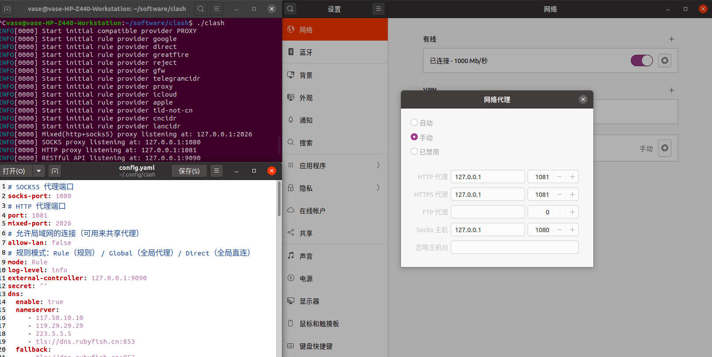
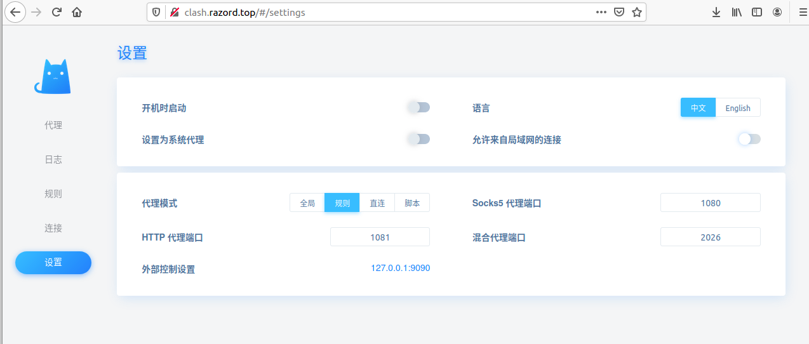

# clash install and using

首先是下载[clash for linux](https://github.com/Dreamacro/clash/releases) https://github.com/Dreamacro/clash/releases

安装好后放到自己软件的文件夹 如/home/username/software/clash

在对应的 clash 文件夹下解压对应的压缩包 如下命令：` gzip -d 'clash.gz'`。

此时 clash 文件并没有权限，将 clash 整个文件夹赋予执行权限：`chmod +x ./clash`。

之后在解压好的文件夹下尝试运行 clash ：` ./clash`。

当提示

> INFO[0022] HTTP proxy listening at :127.0.0.1:7890
>
> INFO[0000] SOCKS proxy listening at : 127.0.0.1:7891
>
> INFO[0000] RESTFul API listening at:127.0.0.1:9090

则表示 clash 正常安装并打开了。

当然配置文件为你在其他平台购买的配置文件，如果第一次没有配置文件会自动生产默认的配置文件，如果系统中没有 MMDB，clash 会自行进行下载和安装。

在正式使用 clash 前，我们需要配置对应的 clash 代理端口和 clash 的配置文件，之后在文件夹下放好对应的 config.yaml。注意  此时 clash 的配置文件目录在`~/.config/clash`下。

重新启动 clash 即可通过[clash 控制台](https://clash.razord.top/#/settings)：clash.razord.top/ 进入控制面板进行操作。

注意控制台输入的端口与给出的'restful API '一致才可登陆正常

